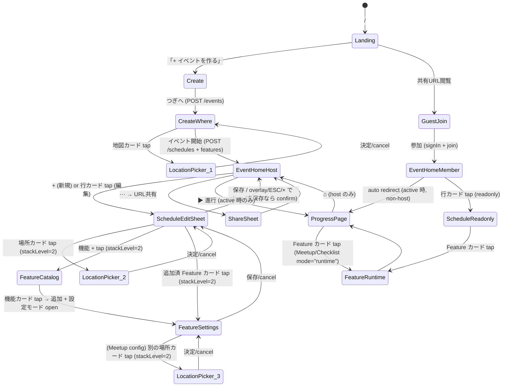

# OMATASE-demo MVP 設計

> 関連: 親規約 [Muraki/CLAUDE.md](../../../CLAUDE.md) / PJ CLAUDE.md [omatase-demo/CLAUDE.md](../CLAUDE.md) / 研究 [00-research-summary.md](../.knowledge/00-research-summary.md) / 旧 mock §3-§4 [omatase-design-mock/.designs/20260510-design-mock.md](../../omatase-design-mock/.designs/20260510-design-mock.md)

---

## 1. 目的

URL ひとつで「待ち合わせ → 当日の進行」を全員でなぞれるイベント運営アプリ MVP デモ。**ホスト/ゲストの登録から進行ページ完了まで実 BE で動く** ことを示し、ハッカソン提出 / VC ピッチ / 友人デモで使う。

旧 `omatase-design-mock` は「Plan 語彙 + モック」までで止めていたので、本 PJ は語彙 (Schedule + Feature) + バックエンド + 認証を載せて作り直す (新規スラッグ、コード資産は最小流用)。

---

## 2. 対象ユーザー / ユースケース

### 2.1 ホスト (イベント作成者) 動線

1. ランディング `/` → 「イベントを作る」
2. イベント作成 `/create` で **イベント名 + 自分の表示名** を入力 (`signIn.anonymous` でホストも匿名ユーザー化)
3. 集合場所/時刻設定 `/create/where` で **集合場所 (地図ピンドラッグ)** と **開始時刻** を決める。これが最初の Schedule (`name=集合, kind=meetup feature 自動付与`) として保存
4. イベントホーム `/e/:eventId` (管理者版) — アナウンス textarea / Schedule 一覧 / メンバー / Event チャット / 「URL 共有」ボタン
5. Schedule 追加: ホーム右上の **44pt 以上** の `+` ボタン → Schedule 編集モーダル (`<ScheduleEditSheet>`) で名前・時刻・場所・メモ・参加メンバー・機能を入力。場所欄タップで共通の `<LocationPickerSheet>` (検索 + 地図 + 現在地)。機能は右上 `+` から `<FeatureCatalogSheet>` (機能一覧) を開き選択追加 → 追加された機能カードをタップして `<FeatureSettingsSheet>` で個別設定
6. Schedule 編集: ホームのスケジュール行カード (`tap target ≥ 60px`) をタップ → 同 `<ScheduleEditSheet>` を `mode=edit` で開き編集/削除可
7. URL 共有モーダル (`<ShareSheet>`) で QR と URL コピー
8. 開始時刻が来ると、ホストは **通常通りイベントホームに着地** (管理操作優先のため切替なし、進行ページへは "▶ 進行を見る" で遷移可)

### 2.2 ゲスト動線

1. 共有 URL `/e/:eventId/join` → 名前入力 → `signIn.anonymous` (`x-guest-name: ${入力名}` ヘッダ付き) で匿名登録 + Event への参加レコード作成
2. イベントホーム `/e/:eventId` (一般版) — アナウンス読み取り / Schedule 一覧 / メンバー / Event チャット (送信可)
3. **開始時刻以降 (= 現在の Schedule が active)** 、ゲストが `/e/:eventId` を開くと **自動で `/e/:eventId/progress` にリダイレクト** (ホストは留まる)

### 2.3 進行時動線 (全員共通)

1. 進行ページ `/e/:eventId/progress` は **「現在の Schedule (`start_at ≦ now < end_at`)」を 1 画面** に表示
2. Feature (集合 / 持ち物確認) は折り畳んだカードで現れ、タップで `<MeetupSheet>` / `<ChecklistSheet>` 展開 (進行モード、`mode="runtime"`)。`<FeatureSettingsSheet>` は **設定モード (`mode="config"`)** のラッパで、進行ページからは展開しない (Schedule 編集モーダル経由のみ)
3. 次の Schedule (上端ヘッダ下) / 前の Schedule (左フリック or 「← 前へ」) を切替可能
4. 「完了」ボタンでホスト/メンバー誰でも前倒し完了可 (status = completed、自動で次の Schedule に遷移)
5. Schedule 内チャット (`<ScheduleChat>`) は 2 秒 polling
6. ホストはヘッダの「⌂ 全体」でイベントホームへ戻れる

---

## 3. デザインテーマ (旧 mock §3 を踏襲、Tailwind v4 で再定義)

### 3.1 トーン

明るく・やわらかく・ゆるい (Apple Maps × Slack 中間)。シリアスな業務感を出さない。重い drop-shadow / 派手な装飾を使わない。装飾より余白で階層。

### 3.2 カラートークン (Tailwind v4 `@theme` で定義)

| トークン | HEX | 用途 |
|---|---|---|
| `--color-brand-500` | `#FF7A59` | プライマリ CTA、アクティブ状態、共有ボタン |
| `--color-brand-100` | `#FFE6DE` | CTA hover、選択ピル背景 |
| `--color-accent-500` | `#3DB7C5` | リンク、地図ピン (自分マーカー) |
| `--color-bg`        | `#FAFAF7` | アプリ背景 |
| `--color-surface`   | `#FFFFFF` | カード・モーダル・Sheet |
| `--color-ink-900`   | `#1F2937` | 本文 |
| `--color-ink-500`   | `#6B7280` | サブテキスト・タイムスタンプ |
| `--color-border`    | `#E5E7EB` | 区切り線 |
| `--color-success`   | `#10B981` | 「参加」「completed」ステータス |
| `--color-warning`   | `#F59E0B` | 「未定」「未チェック」ステータス |

### 3.3 タイポ / 余白 / 角丸

- フォント: system-ui スタック (`system-ui, -apple-system, "Hiragino Sans", "Noto Sans JP", sans-serif`)。**追加 webfont をロードしない**
- 時刻表示: tabular nums (`tabular-nums`)
- 余白: 8px グリッド (`gap-2/4/6`)
- 角丸: カード `rounded-2xl` (16px) / Sheet `rounded-t-3xl` / ボタン `rounded-full`
- シャドウ: `shadow-sm` 〜 `shadow-md`、重ねない
- z-index: **modal/sheet は `z-[1100]`** ([leaflet z-index gotcha 厳守](../../../knowledge/gotcha/leaflet-zindex-vs-modal.md))

### 3.4 モバイル枠 (PC 表示時)

PC で開くと 375×812 のモバイル枠を画面中央配置 (`MobileFrame`)。背景は `#EEEEEC`、フレームは `rounded-3xl shadow-md`。モバイルでは全面。**旧 mock の `MobileFrame` `Avatar` は流用、`MapSection` は依存揃ってるので流用、`ChatBox` は UI 殻のみ参考 (ロジック書き直し)**。

### 3.5 タップターゲット規約 (WCAG 2.5.5 / Apple HIG)

- **interactive 要素の最小寸法: 44×44 pt** (Apple HIG, WCAG 2.5.5 Level AAA に準拠)。ボタン、アイコンボタン、トグル、チップ、リンクすべてに適用
- 主要 CTA (`+` ボタン、保存ボタン、決定ボタン): **48×48 pt 以上** を目安に余裕を持つ
- **タップ可能なカード** (スケジュール行、Feature カード、メンバー行): **行高 60px 以上** を確保し、active 時に `bg-brand-100` で feedback。`cursor-pointer` + `transition-colors` を必須
- 隣接 interactive 要素の **間隔最小 8px** (`gap-2`)。`+` ボタンと同一行に置く要素は `gap-3` (12px) 推奨
- **静的「指摘」**: 旧設計に存在した「右上 [⋯]」「`+` chip」等のサイズ無指定は本規約で **44pt 最低保証**へ統一。Tailwind では `min-w-11 min-h-11` (= 44px) を Reviewer がテストする

### 3.6 モーダル / Sheet 共通規約

すべての Modal / Sheet (`<Modal>`, `<Sheet>`) は以下を **3 種すべて** 満たす:

1. **overlay (空白) tap で close** — 背景の dim layer (`bg-black/40 backdrop-blur-[2px]`) をタップ → onDismiss 発火
2. **ESC キーで close** — `keydown` listener、`document.body` レベル
3. **右上 × ボタン (`<CloseButton>`、44×44 pt)** — 視覚的な明示。タップ → onDismiss 発火

例外: **destructive な未保存変更を持つ Sheet** (例: Schedule 編集で title 変更後) は overlay tap で **「破棄しますか?」確認 prompt** を挟む。ESC / × も同じ confirm 経路。確認 prompt 自体は `window.confirm` で良い (MVP 簡略化)。

実装方針: 上記を全 Modal/Sheet が個別実装すると規約逸脱が起きるため、`<Modal>` / `<Sheet>` を **基底コンポーネント** として `src/client/components/Modal.tsx` / `Sheet.tsx` に置き、`<ScheduleEditSheet>` 等は内部で `<Sheet>` を使う。基底コンポーネントの責務:

- `<Modal>` (中央配置、画面 60-80% 占有): `/e/.../join` の警告系・URL コピー後 toast、確認 prompt 等
- `<Sheet>` (画面下からスライドアップ、`rounded-t-3xl`、画面 80-95% 占有): 編集系・場所選択・機能一覧。MD3 Bottom Sheet ガイドラインに従う

z-index 規約: 全 Modal/Sheet で `z-[1100]` ([leaflet z-index gotcha](../../../knowledge/gotcha/leaflet-zindex-vs-modal.md))。overlay は `z-[1099]`。**Sheet on Sheet** (例: ScheduleEditSheet の上に LocationPickerSheet) の場合、内側 Sheet は `z-[1110]`、その overlay は `z-[1109]` で重ねる。stack 深さは MVP では最大 2 (Sheet 上に Sheet) を許可、それ以上禁止。

`<Sheet>` API (TS):
```ts
interface SheetProps {
  open: boolean;
  onDismiss: () => void;              // overlay/ESC/× 共通
  title?: string;                     // header に表示
  rightAction?: { label: string; onClick: () => void; intent?: "primary"|"plain" };  // 「保存」等
  dismissConfirm?: () => boolean | Promise<boolean>;  // 「未保存変更あり時の confirm」、true で実 close
  children: React.ReactNode;
  stackLevel?: 1 | 2;                 // z-index 制御。default=1
}
```

`<Modal>` も同様 API。詳細仕様は本書 §12.13 参照。

---

## 4. プロジェクト構造

### 4.1 リポジトリ構成: **単一 repo + flat 配置 (apps/api・apps/web に分けない)**

採用根拠:
- 1 機能 MVP、共有型 1 ファイル (`src/shared/types.ts`) で済む
- Vite が `src/` 配下のフロントを build、Hono が `src/server/` でサーバ起動、テストは `src/` 全体に Vitest
- monorepo (turborepo / nx) を入れるほどの分量ではない
- TypeScript の path alias で `@/shared/*` `@/server/*` `@/client/*` を切れば衝突しない (※ alias は **client 側のみ**、server は NodeNext で relative + `.js` 拡張子。詳細 §4.3.1)

### 4.2 ディレクトリ

```
omatase-demo/
├── package.json
├── tsconfig.json                         # client/共通用。moduleResolution=Bundler、paths で @ alias 定義
├── tsconfig.server.json                  # server build 専用。module=NodeNext (詳細 §4.3.1)
├── vite.config.ts                        # @tailwindcss/vite plugin、API proxy 設定
├── vitest.config.ts                      # 環境別 (jsdom / node) で 2 project
├── drizzle.config.ts
├── Dockerfile                            # multi-stage、最終は Node + 静的配信を Hono 自身が serve (§10 参照)
├── .dockerignore
├── .env.example
├── drizzle/                              # drizzle-kit が生成する migration
│   └── *.sql
├── src/
│   ├── shared/
│   │   ├── types.ts                      # API DTO 型 (共通)
│   │   ├── schema.ts                     # zod (共通入力 schema)
│   │   ├── feature-config.ts             # FeatureConfig zod discriminated union
│   │   └── time.ts                       # 時刻判定ヘルパ (純関数、サーバ/クライアント両用)
│   ├── server/                           # Hono + Drizzle (Node 環境)
│   │   ├── app.ts                        # ★ export const app = new Hono()。route mount のみ、serve しない
│   │   ├── index.ts                      # ★ 薄い serve wrapper。テストからは import しない
│   │   ├── auth.ts                       # better-auth インスタンス
│   │   ├── db/
│   │   │   ├── client.ts                 # better-sqlite3 + drizzle、WAL 有効化
│   │   │   ├── schema.ts                 # 全 schema を re-export (drizzle-kit 用)
│   │   │   ├── auth-schema.ts            # user/session/account/verification (better-auth cli で生成)
│   │   │   └── domain-schema.ts          # event/schedule/feature/state/announcement/chat/membership
│   │   ├── routes/
│   │   │   ├── events.ts                 # /api/events
│   │   │   ├── schedules.ts              # /api/events/:eventId/schedules ...
│   │   │   ├── features.ts               # /api/schedules/:sid/features
│   │   │   ├── announcements.ts
│   │   │   ├── chats.ts                  # event chat + schedule chat
│   │   │   ├── progress.ts               # /api/events/:eventId/progress (集約 endpoint)
│   │   │   └── members.ts                # /api/events/:eventId/members
│   │   └── lib/
│   │       ├── error.ts                  # AppError + errorMiddleware
│   │       └── guard.ts                  # 認可ヘルパ (isHost / isMember)
│   ├── client/                           # React + TanStack Router (browser 環境)
│   │   ├── main.tsx
│   │   ├── index.css                     # @import "tailwindcss"; @theme {...}
│   │   ├── router.tsx                    # ★ createAppRouter(queryClient) factory
│   │   ├── routes/
│   │   │   ├── __root.tsx
│   │   │   ├── index.tsx                 # /
│   │   │   ├── create.tsx                # /create
│   │   │   ├── create.where.tsx          # /create/where
│   │   │   ├── e.$eventId.tsx            # /e/:eventId (イベントホーム)
│   │   │   ├── e.$eventId.join.tsx       # /e/:eventId/join (ゲスト名入力)
│   │   │   └── e.$eventId.progress.tsx   # /e/:eventId/progress (進行)
│   │   ├── api/
│   │   │   ├── client.ts                 # fetch wrapper (credentials: "include")
│   │   │   ├── queryKeys.ts              # ★ QK 集約
│   │   │   └── hooks/                    # useEvent / useSchedules / useProgress / useChat / ...
│   │   ├── components/
│   │   │   ├── MobileFrame.tsx           # 旧 mock 流用
│   │   │   ├── MapSection.tsx            # 旧 mock 流用 (react-leaflet ラッパ、static 表示用)
│   │   │   ├── Avatar.tsx                # 旧 mock 流用
│   │   │   ├── Modal.tsx                 # 共通: overlay tap/ESC/× で close (§3.6)
│   │   │   ├── Sheet.tsx                 # 共通 BottomSheet: 同上 (§3.6)
│   │   │   ├── PeriodBanner.tsx          # イベント期間表示 (§12.4)
│   │   │   ├── ScheduleList.tsx          # 行カード (tap で edit Sheet) (§12.4)
│   │   │   ├── ScheduleEditSheet.tsx     # 編集モーダル (新規/編集兼用) (§12.6)
│   │   │   ├── FeatureCatalogSheet.tsx   # 機能一覧モーダル (右上 + から) (§12.6.4)
│   │   │   ├── FeatureSettingsSheet.tsx  # 設定モード dispatcher (kind 別に Meetup/Checklist Sheet を呼ぶ) (§12.7/§12.8)
│   │   │   ├── MeetupSheet.tsx           # 集合 (mode: "config" | "runtime") (§12.7)
│   │   │   ├── ChecklistSheet.tsx        # 持ち物 (mode: "config" | "runtime") (§12.8)
│   │   │   ├── LocationPickerSheet.tsx   # 場所検索 + 地図 + 現在地、共通モーダル (§12.12)
│   │   │   ├── AnnouncementBoard.tsx
│   │   │   ├── ChatBox.tsx               # 殻のみ流用、polling は hook 側
│   │   │   ├── ShareSheet.tsx            # QR + コピー
│   │   │   ├── ChecklistDoneBanner.tsx   # 全員チェック完了の管理者向け通知 (§12.9.1, §7.5.10)
│   │   │   ├── ProgressView.tsx
│   │   │   └── ...
│   │   └── lib/
│   │       ├── visibility.ts             # document.visibilityState ラッパ
│   │       └── clipboard.ts
│   └── tests/                            # 後述 §9
│       ├── setup.client.ts
│       ├── setup.server.ts
│       ├── helpers/
│       │   ├── app.ts                    # export { app } from "../../server/app"
│       │   ├── auth-cookie.ts            # Hono signed cookie 生成
│       │   ├── db.ts                     # in-memory SQLite + migration
│       │   ├── render.tsx                # RTL + Router + Query Provider
│       │   └── fixtures.ts
│       ├── server/<...>.test.ts
│       └── client/<...>.test.tsx
```

### 4.3 依存 (`package.json` 主要)

```jsonc
{
  "scripts": {
    "dev:server": "tsx watch src/server/index.ts",
    "dev:client": "vite",
    "dev":        "concurrently -k -n SRV,WEB \"npm:dev:server\" \"npm:dev:client\"",
    "build:client": "vite build",
    "build:server": "tsc -p tsconfig.server.json",
    "build":      "npm run build:client && npm run build:server",
    "start":      "node dist/server/index.js",
    "test":       "vitest run",
    "test:watch": "vitest",
    "db:generate":"drizzle-kit generate",
    "db:migrate": "drizzle-kit migrate",
    "auth:generate":"better-auth generate --output src/server/db/auth-schema.ts",
    "typecheck":  "tsc --noEmit"
  },
  "dependencies": {
    "@better-auth/drizzle-adapter": "^1.6.11",
    "@hono/node-server": "^2.0.4",
    "@hono/zod-validator": "^0.8.0",
    "@tanstack/react-query": "^5.100.14",
    "@tanstack/react-router": "^1.170.8",
    "better-auth": "^1.6.11",
    "better-sqlite3": "^12.10.0",
    "drizzle-orm": "^0.45.2",
    "hono": "^4.12.23",
    "leaflet": "^1.9.4",
    "qrcode.react": "^4.2.0",
    "react": "^19.2.6",
    "react-dom": "^19.2.6",
    "react-leaflet": "^5.0.0",
    "zod": "^4"
  },
  "devDependencies": {
    "@better-auth/cli": "^1.4.21",
    "@tailwindcss/vite": "^4.3.0",
    "@tanstack/router-plugin": "^1.170.8",
    "@testing-library/jest-dom": "^6",
    "@testing-library/react": "^16",
    "@testing-library/user-event": "^14",
    "@types/better-sqlite3": "^7",
    "@types/leaflet": "^1.9",
    "@types/node": "^22",
    "@types/react": "^19",
    "@types/react-dom": "^19",
    "@vitejs/plugin-react": "^5",
    "concurrently": "^9",
    "drizzle-kit": "^0.31.10",
    "jsdom": "^25",
    "tailwindcss": "^4.3.0",
    "tsx": "^4",
    "typescript": "^5.7",
    "vite": "^8.0.14",
    "vitest": "^4.1.7"
  }
}
```

#### 4.3.1 server build / TypeScript 設定 (NodeNext + `.js` 拡張子)

`tsconfig.json` (root) は **client (Vite) 用** に最適化されており、別途 `tsconfig.server.json` を **server build 専用**に用意する。両者の整合性ミスでビルド時に import が解決できなくなる事故が発生しやすいので、以下を**規約として固定**:

- `tsconfig.server.json`: `"module": "NodeNext"` + `"moduleResolution": "NodeNext"`、`outDir: "dist/server"`、`include: ["src/server/**/*", "src/shared/**/*"]`
- `tsconfig.json` (root): client は Vite が bundler 解決するので `"moduleResolution": "Bundler"` のまま OK。`paths` で `"@/*": ["./src/*"]` alias 定義
- **server source の relative import は全て `.js` 拡張子付き**で書く (例: `import { foo } from "../lib/foo.js"`)。`NodeNext` は ESM runtime 解決規則に従うため、`.ts` を書いても build 後の `.js` を import できない (TypeScript の rewrite はしない)
- **server source では `@/*` alias を使わない**。NodeNext runtime は `tsconfig.paths` を解釈しない (node 標準 ESM resolver には paths 概念がない) ため、build 後の dist で `Cannot find module '@/shared/types'` になる
- **client source では `@/*` alias を使ってよい** (Vite が解決する)
- **shared (`src/shared/**`)** は client/server 双方から import される。server から見る時は relative + `.js` 拡張子、client から見る時は `@/shared/*` で書いてよい。shared 内部の相対 import は **`.js` 拡張子付き** で揃える (server build 経路で壊れないように)

### 4.4 Tailwind v4 構成 (CSS-first config)

`vite.config.ts`:
```ts
import { defineConfig } from "vite";
import react from "@vitejs/plugin-react";
import tailwindcss from "@tailwindcss/vite";
import { TanStackRouterVite } from "@tanstack/router-plugin/vite";

export default defineConfig({
  plugins: [react(), tailwindcss(), TanStackRouterVite()],
  server: {
    port: 5173,
    proxy: { "/api": "http://localhost:8080" }, // dev 時 API は別 port
  },
  build: { outDir: "dist/client" },
});
```

`src/client/index.css`:
```css
@import "tailwindcss";
@import "leaflet/dist/leaflet.css";

@theme {
  --color-brand-500: #FF7A59;
  --color-brand-100: #FFE6DE;
  --color-accent-500: #3DB7C5;
  --color-bg: #FAFAF7;
  --color-surface: #FFFFFF;
  --color-ink-900: #1F2937;
  --color-ink-500: #6B7280;
  --color-border: #E5E7EB;
  --color-success: #10B981;
  --color-warning: #F59E0B;
  --font-sans: system-ui, -apple-system, "Hiragino Sans", "Noto Sans JP", sans-serif;
  --radius-2xl: 1rem;
  --radius-3xl: 1.5rem;
}
```

これで `bg-brand-500` `text-ink-900` などの utility が自動生成される。**`tailwind.config.ts` は作らない**。

---

## 5. データモデル (Drizzle schema)

### 5.1 全体図 (mermaid)

```mermaid
erDiagram
  user ||--o{ session : has
  user ||--o{ account : has
  user ||--o{ membership : participates
  event ||--o{ membership : has
  event ||--o{ schedule : has
  event ||--o{ event_chat_message : has
  event ||--o{ announcement : has
  schedule ||--o{ schedule_feature : has
  schedule ||--o{ schedule_chat_message : has
  schedule_feature ||--o{ schedule_feature_state : has
  user ||--o{ membership : ""
  user ||--o{ schedule_member : opt-out/in
  schedule ||--o{ schedule_member : has
```

### 5.2 better-auth schema (auto generated, here for reference)

`npx @better-auth/cli generate --output src/server/db/auth-schema.ts` で生成。anonymous plugin を auth.ts に入れた状態で実行すると `user.isAnonymous` が付与される。

```ts
// src/server/db/auth-schema.ts (生成想定、verbatim 確認後 commit)
import { sqliteTable, text, integer } from "drizzle-orm/sqlite-core";

export const user = sqliteTable("user", {
  id: text("id").primaryKey(),
  name: text("name").notNull(),
  email: text("email").notNull().unique(),
  emailVerified: integer("email_verified", { mode: "boolean" }).default(false).notNull(),
  image: text("image"),
  isAnonymous: integer("is_anonymous", { mode: "boolean" }).default(false).notNull(),
  createdAt: integer("created_at", { mode: "timestamp_ms" }).notNull(),
  updatedAt: integer("updated_at", { mode: "timestamp_ms" }).$onUpdate(() => new Date()).notNull(),
});

export const session = sqliteTable("session", {
  id: text("id").primaryKey(),
  userId: text("user_id").notNull().references(() => user.id, { onDelete: "cascade" }),
  expiresAt: integer("expires_at", { mode: "timestamp_ms" }).notNull(),
  token: text("token").notNull().unique(),
  ipAddress: text("ip_address"),
  userAgent: text("user_agent"),
  createdAt: integer("created_at", { mode: "timestamp_ms" }).notNull(),
  updatedAt: integer("updated_at", { mode: "timestamp_ms" }).$onUpdate(() => new Date()).notNull(),
});

export const account = sqliteTable("account", { /* ... */ });
export const verification = sqliteTable("verification", { /* ... */ });
```

### 5.3 domain schema

```ts
// src/server/db/domain-schema.ts
import {
  sqliteTable, text, integer, index, primaryKey,
} from "drizzle-orm/sqlite-core";
import { user } from "./auth-schema.js";
import type { FeatureConfig, ChecklistState } from "../../shared/feature-config.js";  // §4.3.1: server は alias 不可、relative + .js 必須

/** イベント。1 ホスト + N ゲスト */
export const event = sqliteTable("event", {
  id: text("id").primaryKey(),                  // nanoid(10), URL に直接出る
  name: text("name").notNull(),
  hostUserId: text("host_user_id").notNull().references(() => user.id, { onDelete: "cascade" }),
  createdAt: integer("created_at", { mode: "timestamp_ms" }).notNull(),
  updatedAt: integer("updated_at", { mode: "timestamp_ms" }).$onUpdate(() => new Date()).notNull(),
}, (t) => [
  index("event_host_idx").on(t.hostUserId),
]);

/** イベントへの参加。host も 1 行持つ */
export const membership = sqliteTable("membership", {
  eventId: text("event_id").notNull().references(() => event.id, { onDelete: "cascade" }),
  userId: text("user_id").notNull().references(() => user.id, { onDelete: "cascade" }),
  role: text("role", { enum: ["host", "member"] }).notNull(),
  joinedAt: integer("joined_at", { mode: "timestamp_ms" }).notNull(),
}, (t) => [
  primaryKey({ columns: [t.eventId, t.userId] }),
  index("membership_event_idx").on(t.eventId),
]);

/** Schedule (1 イベント内の予定単位) */
export const schedule = sqliteTable("schedule", {
  id: text("id").primaryKey(),                  // nanoid(12)
  eventId: text("event_id").notNull().references(() => event.id, { onDelete: "cascade" }),
  name: text("name").notNull(),                 // "東京駅集合", "ホテルにチェックイン"
  startAt: integer("start_at", { mode: "timestamp_ms" }).notNull(),
  endAt: integer("end_at", { mode: "timestamp_ms" }).notNull(),
  /** 位置情報。null 許容 (例: 「ホテルチェックイン」で同建物内なら lat/lng 不要) */
  locationLat: integer("location_lat", { mode: "number" }),    // float OK だが SQLite は REAL に格納
  locationLng: integer("location_lng", { mode: "number" }),
  locationLabel: text("location_label"),
  memo: text("memo"),
  /** "upcoming" | "active" | "completed" の表示用キャッシュ。実時刻判定が優先 (§7.3) */
  status: text("status", { enum: ["upcoming", "active", "completed"] }).default("upcoming").notNull(),
  position: integer("position").notNull().default(0),  // 同時刻のタイブレーカ
  createdAt: integer("created_at", { mode: "timestamp_ms" }).notNull(),
  updatedAt: integer("updated_at", { mode: "timestamp_ms" }).$onUpdate(() => new Date()).notNull(),
}, (t) => [
  index("schedule_event_time_idx").on(t.eventId, t.startAt, t.endAt),
  index("schedule_event_status_idx").on(t.eventId, t.status),
]);

/**
 * Schedule の参加メンバー絞り込み。
 * デフォは「Schedule に行が無い = Event 全員参加」、明示行がある時のみその行を使う (opt-in override)。
 * UI 上「全員」トグル OFF → 個別チェック制に切り替わり、行が作成される。
 */
export const scheduleMember = sqliteTable("schedule_member", {
  scheduleId: text("schedule_id").notNull().references(() => schedule.id, { onDelete: "cascade" }),
  userId: text("user_id").notNull().references(() => user.id, { onDelete: "cascade" }),
  joinedAt: integer("joined_at", { mode: "timestamp_ms" }).notNull(),
}, (t) => [
  primaryKey({ columns: [t.scheduleId, t.userId] }),
]);

/** polymorphic Feature (pattern/polymorphic-feature-plugin-sqlite.md 準拠) */
export const scheduleFeature = sqliteTable("schedule_feature", {
  id: text("id").primaryKey(),
  scheduleId: text("schedule_id").notNull().references(() => schedule.id, { onDelete: "cascade" }),
  kind: text("kind").notNull(),                 // ❗ enum で固定しない (将来 plugin 追加に備える)
  config: text("config", { mode: "json" }).$type<FeatureConfig>().notNull(),
  position: integer("position").notNull().default(0),
  createdAt: integer("created_at", { mode: "timestamp_ms" }).notNull(),
  updatedAt: integer("updated_at", { mode: "timestamp_ms" }).$onUpdate(() => new Date()).notNull(),
}, (t) => [
  index("schedule_feature_schedule_idx").on(t.scheduleId, t.position),
]);

/** Feature の per-user 状態 (持ち物チェック等)。config と life cycle が違うので分離 */
export const scheduleFeatureState = sqliteTable("schedule_feature_state", {
  featureId: text("feature_id").notNull().references(() => scheduleFeature.id, { onDelete: "cascade" }),
  userId: text("user_id").notNull().references(() => user.id, { onDelete: "cascade" }),
  state: text("state", { mode: "json" }).$type<ChecklistState | Record<string, never>>().notNull(),
  updatedAt: integer("updated_at", { mode: "timestamp_ms" }).notNull(),
}, (t) => [
  primaryKey({ columns: [t.featureId, t.userId] }),
]);

/** 管理者→全員のアナウンス。Event ホーム/進行ページのトップに常時表示 */
export const announcement = sqliteTable("announcement", {
  id: text("id").primaryKey(),
  eventId: text("event_id").notNull().references(() => event.id, { onDelete: "cascade" }),
  authorUserId: text("author_user_id").notNull().references(() => user.id, { onDelete: "cascade" }),
  body: text("body").notNull(),
  createdAt: integer("created_at", { mode: "timestamp_ms" }).notNull(),
}, (t) => [
  index("announcement_event_idx").on(t.eventId, t.createdAt),
]);

/** Event 全体チャット */
export const eventChatMessage = sqliteTable("event_chat_message", {
  id: text("id").primaryKey(),
  eventId: text("event_id").notNull().references(() => event.id, { onDelete: "cascade" }),
  authorUserId: text("author_user_id").notNull().references(() => user.id, { onDelete: "cascade" }),
  body: text("body").notNull(),
  createdAt: integer("created_at", { mode: "timestamp_ms" }).notNull(),
}, (t) => [
  index("event_chat_event_idx").on(t.eventId, t.createdAt),
]);

/** Schedule 内チャット */
export const scheduleChatMessage = sqliteTable("schedule_chat_message", {
  id: text("id").primaryKey(),
  scheduleId: text("schedule_id").notNull().references(() => schedule.id, { onDelete: "cascade" }),
  authorUserId: text("author_user_id").notNull().references(() => user.id, { onDelete: "cascade" }),
  body: text("body").notNull(),
  createdAt: integer("created_at", { mode: "timestamp_ms" }).notNull(),
}, (t) => [
  index("schedule_chat_schedule_idx").on(t.scheduleId, t.createdAt),
]);
```

`src/server/db/schema.ts` は全部 re-export するだけ (drizzle-kit 用):
```ts
export * from "./auth-schema.js";       // §4.3.1: NodeNext、相対 + .js
export * from "./domain-schema.js";
```

#### 5.3.1 migration 生成規約

- **生成コマンド**: `npx drizzle-kit generate` で `drizzle/<num>_<name>.sql` を生成 (自動採番、`db:generate` script で叩く)
- **`-->statement-breakpoint` 区切りが必須**: 複数 DDL ステートメント (`CREATE TABLE` / `CREATE INDEX` / `ALTER TABLE` など) を 1 つの migration ファイルに書く場合、各ステートメントの**間に** `-->statement-breakpoint` コメント区切りを入れる。drizzle migrator (`migrate()`) はこの区切りで SQL を分割実行するため、区切りが無いと **先頭ステートメントしか実行されない** (better-sqlite3 の `exec` は単一ステートメント前提のため後続が無視される)
- **drizzle-kit が自動生成する出力は既に区切り入り**なので、手書きで migration を編集する時のみ注意。手書きで追加した DDL が起動時 migration で反映されない場合、まず区切り抜けを疑う
- **適用**: dev は `npm run db:migrate`、production は `src/server/index.ts` の起動時に `migrate(db, { migrationsFolder: "./drizzle" })` を呼ぶ (§10.5)

### 5.4 FeatureConfig (zod discriminated union)

```ts
// src/shared/feature-config.ts
import { z } from "zod";

export const meetupConfigSchema = z.object({
  kind: z.literal("meetup"),
  /** 場所の出どころ。inherit:true なら schedule.location* を使う。false なら独自指定 */
  location: z.discriminatedUnion("inherit", [
    z.object({ inherit: z.literal(true) }),
    z.object({
      inherit: z.literal(false),
      lat: z.number(),
      lng: z.number(),
      label: z.string().min(1).max(80),
    }),
  ]),
  /** 集合チェックイン (旧 QR 出欠を吸収)。ボタン式 ("到着しました" を押す)、QR は MVP では出さない */
  checkInEnabled: z.boolean().default(true),
});

export const checklistConfigSchema = z.object({
  kind: z.literal("checklist"),
  items: z.array(z.object({
    id: z.string().min(1),
    label: z.string().min(1).max(80),
    required: z.boolean().default(true),
  })).min(1).max(50),
});

export const featureConfigSchema = z.discriminatedUnion("kind", [
  meetupConfigSchema,
  checklistConfigSchema,
]);
export type FeatureConfig = z.infer<typeof featureConfigSchema>;
export type MeetupConfig    = z.infer<typeof meetupConfigSchema>;
export type ChecklistConfig = z.infer<typeof checklistConfigSchema>;

/** state */
export const checklistStateSchema = z.object({
  kind: z.literal("checklist"),
  checked: z.record(z.string(), z.boolean()),   // item.id → checked
});
export const meetupStateSchema = z.object({
  kind: z.literal("meetup"),
  checkedInAt: z.number().nullable(),           // null = まだ
});
export type ChecklistState = z.infer<typeof checklistStateSchema>;
export type MeetupState = z.infer<typeof meetupStateSchema>;
```

### 5.5 Feature kind 表 (現存 plugin)

| kind | config schema | state schema | UI Sheet | 集計関心 |
|---|---|---|---|---|
| `meetup` | `meetupConfigSchema` | `meetupStateSchema` | `<MeetupSheet>` | 「集合済み人数 / メンバー数」をホストへ |
| `checklist` | `checklistConfigSchema` | `checklistStateSchema` | `<ChecklistSheet>` | 「全アイテム済人数 / メンバー数」をホストへ + 個人別チェック |

新 kind 追加手順 (再掲): zod schema に 1 entry 追加 + UI コンポーネント追加。**DB migration 不要**。

### 5.6 共通 DTO 型 (`src/shared/types.ts`)

```ts
export type Iso = string;     // ISO8601 string (API では時刻を ms epoch ではなく ISO で返す)

export interface EventDTO {
  id: string; name: string; hostUserId: string;
  createdAt: Iso; updatedAt: Iso;
  /** 呼び出しユーザーが host か */ viewerIsHost: boolean;
}
export interface MemberDTO  { userId: string; name: string; role: "host"|"member"; joinedAt: Iso; }
export interface ScheduleLocationDTO { lat: number; lng: number; label: string; } 
export interface ScheduleDTO {
  id: string; eventId: string; name: string;
  startAt: Iso; endAt: Iso;
  location: ScheduleLocationDTO | null;
  memo: string | null;
  status: "upcoming"|"active"|"completed";
  position: number;
  members: string[];   // userId[]、空配列 = 「Event 全員」(scheduleMember 行が無いケース) を意味させない: API レイヤで全展開した結果を返す
  featureSummaries: FeatureSummaryDTO[];
}
export interface FeatureSummaryDTO {
  id: string; kind: "meetup"|"checklist"; position: number;
  /**
   * 集計: 全 kind 共通で `doneCount`/`totalMembers` を返し、`allMembersDone` (全員完了) フラグも返す。
   * - checklist: `doneCount` = required アイテムすべて true な member 数、`allMembersDone` = `doneCount === totalMembers` (totalMembers>0 の時のみ)
   * - meetup:    `doneCount` = `checkedInAt !== null` な member 数、`allMembersDone` 同上
   * バナー表示 (§7.5.10) は **`kind="checklist"` かつ `allMembersDone=true`** を条件とする。
   */
  summary: { doneCount: number; totalMembers: number; allMembersDone: boolean };
}
export interface FeatureDTO {
  id: string; scheduleId: string; kind: "meetup"|"checklist"; position: number;
  config: FeatureConfig;          // 上で定義
  state: Record<string, unknown>; // 呼び出しユーザー自身の state
  aggregate?: { doneCount: number; totalMembers: number; /* checklist のみ: per-item count */ perItem?: Record<string, number> };
}
export interface ChatMessageDTO { id: string; authorUserId: string; authorName: string; body: string; createdAt: Iso; }
export interface AnnouncementDTO { id: string; authorUserId: string; authorName: string; body: string; createdAt: Iso; }

/** イベント期間バナー (§12.4) 用。schedule 0 件なら null */
export interface PeriodSummaryDTO {
  startAt: Iso;          // min(schedules.startAt)
  endAt:   Iso;          // max(schedules.endAt)
  /** 同一日判定済みフラグ (server で計算済み)。client は表示分岐に使うだけ */
  sameDay: boolean;
}

/** /api/events/:id/progress 集約レスポンス (進行ページ 1 リクで全部取る) */
export interface ProgressDTO {
  event: EventDTO;
  members: MemberDTO[];
  current: ScheduleWithFeaturesDTO | null;
  prev:    ScheduleDTO | null;
  next:    ScheduleDTO | null;
  latestAnnouncement: AnnouncementDTO | null;
  /** 全 Schedule 共通の期間バナー source (§12.4) */
  period: PeriodSummaryDTO | null;
  serverNow: Iso;
}
export interface ScheduleWithFeaturesDTO extends ScheduleDTO {
  features: FeatureDTO[];
}
```

---

## 6. API 設計 (Hono routes)

### 6.1 規約

- **REST + JSON。 RPC は採用しない** (URL で対象が見える方が curl/log デバッグしやすい、TanStack Query の queryKey も URL ベースで揃う)
- リクエスト body は `zod` validate via `@hono/zod-validator`
- レスポンス: 成功は `200/201`、エラーは `{ "code": "STR_UPPER", "message": string }` を `4xx/5xx` で返す
- 認可: Hono middleware で `c.var.user` を読み、必要 route で `requireUser()` / `requireHost(eventId)` を呼ぶ
- 全 endpoint は `/api/` prefix。better-auth は `/api/auth/**` を専有
- 時刻は **ISO8601 string で送受信** (JS の Date インスタンス化を明示的にする、TZ ズレ防止)
- **datetime offset 規約**: 全 endpoint で datetime フィールドの zod schema は `z.string().datetime({ offset: true })` を使い、**UTC suffix `Z` と `±HH:MM` offset の両形式**を受け付ける (例: `2026-06-01T10:00:00Z` / `2026-06-01T19:00:00+09:00` のどちらも valid)。対象フィールド: `schedule.startAt` `schedule.endAt` `event.meetingAt` `progress.serverNow`、その他全 `Iso` 型の入出力
- **client 運用ガイド**: `<input type="datetime-local">` から取得した値 (`"2026-06-01T19:00"` のような local naive 形式) は server に送る前に **`new Date(value).toISOString()` で UTC 化**する。生の local 文字列 (offset / Z なし) はバリデーション失敗 (`400 BAD_REQUEST`) として扱う

### 6.2 エラーコード一覧 (明示。example ではなく**全列挙**)

| HTTP | code | 発生条件 |
|---|---|---|
| 400 | `BAD_REQUEST` | zod validate 失敗 (詳細は `details` に zod issues) |
| 401 | `UNAUTHENTICATED` | session 不在で要 auth route を叩いた |
| 403 | `FORBIDDEN_NOT_HOST` | host 限定 route をメンバーが叩いた |
| 403 | `FORBIDDEN_NOT_MEMBER` | member 限定 route を非参加者が叩いた |
| 404 | `EVENT_NOT_FOUND` | eventId 不在 |
| 404 | `SCHEDULE_NOT_FOUND` | scheduleId 不在 or event mismatch |
| 404 | `FEATURE_NOT_FOUND` | featureId 不在 or schedule mismatch |
| 409 | `ALREADY_MEMBER` | 既参加ユーザーが /join を叩いた (冪等扱いで 200 にしても良いが、明示) |
| 409 | `INVALID_SCHEDULE_TIME` | endAt ≦ startAt |
| 500 | `INTERNAL` | 想定外。errorMiddleware が他の例外を全部ここに丸める |

[Hono errorMiddleware で AppError の status を読み損ねると 500 になる gotcha](../../../knowledge/gotcha/hono-error-middleware-apperror-status.md) に従い、`AppError` は `class AppError extends Error { constructor(public status: number, public code: string, message?: string){ super(message); } }`、errorMiddleware で `if (err instanceof AppError) return c.json({ code: err.code, message: err.message }, err.status)` を**明示**。

### 6.3 endpoint 一覧

#### 6.3.1 認証 (better-auth が提供、参考)

| Method | Path | 用途 |
|---|---|---|
| POST | `/api/auth/sign-in/anonymous` | 名前ヘッダ込みで匿名登録 (詳細 §8) |
| POST | `/api/auth/sign-out` | サインアウト |
| GET  | `/api/auth/get-session` | 現セッション取得 |

#### 6.3.2 Event

| Method | Path | auth | body / params | response |
|---|---|---|---|---|
| POST | `/api/events` | user | `{ name: string }` | `201 { event: EventDTO }`。**呼び出しユーザーが自動で host membership 取得**、最初の Schedule (`name="集合"`) は **作らない** (`/create/where` 後の `POST /schedules` で作る) |
| GET  | `/api/events/:eventId` | user (member or 公開) | — | `200 { event: EventDTO; members: MemberDTO[]; viewerIsMember: boolean; period: PeriodSummaryDTO\|null }`。**非メンバーが叩いても OK** (これにより `/join` 画面でイベント名を出せる)、ただし `viewerIsMember=false` の時 schedules/chat 等は別 endpoint で 403。`period` は schedule 集計のため非 member でも返す (Phase 2 で隠蔽可) |
| POST | `/api/events/:eventId/join` | user | — | `200 { membership: MemberDTO }`。`x-guest-name` 不要 (登録時に注入済み)。既参加なら `409 ALREADY_MEMBER` |
| GET  | `/api/events/:eventId/members` | member | — | `200 { members: MemberDTO[] }` |

#### 6.3.3 Schedule

| Method | Path | auth | body | response |
|---|---|---|---|---|
| GET | `/api/events/:eventId/schedules` | member | — | `200 { schedules: ScheduleDTO[] }` (時刻昇順、`position` でタイブレーク) |
| POST | `/api/events/:eventId/schedules` | host | `{ name, startAt, endAt, location: ScheduleLocationDTO\|null, memo?, members?: string[]\|null }` (`members=null` で「Event 全員」、配列で個別指定) | `201 { schedule: ScheduleDTO }` |
| GET | `/api/schedules/:scheduleId` | member | — | `200 { schedule: ScheduleWithFeaturesDTO }` |
| PATCH | `/api/schedules/:scheduleId` | host | partial body | `200 { schedule: ScheduleDTO }`。`endAt ≦ startAt` で 409 |
| DELETE | `/api/schedules/:scheduleId` | host | — | `204` |
| POST | `/api/schedules/:scheduleId/complete` | member | — | `200 { schedule: ScheduleDTO }`。status を `completed` に WRITE (前倒し完了) |

#### 6.3.4 Feature

| Method | Path | auth | body | response |
|---|---|---|---|---|
| POST | `/api/schedules/:scheduleId/features` | host | `{ kind: "meetup"\|"checklist", config: FeatureConfig }` | `201 { feature: FeatureDTO }`。config は zod 検証 |
| GET  | `/api/features/:featureId` | member | — | `200 { feature: FeatureDTO }` |
| PATCH | `/api/features/:featureId` | host | `{ config?: FeatureConfig, position?: number }` | `200 { feature: FeatureDTO }` |
| DELETE | `/api/features/:featureId` | host | — | `204` |
| PUT | `/api/features/:featureId/state` | member | `{ state: <ChecklistState\|MeetupState> }` | `200 { state }`。upsert (`schedule_feature_state` の primary key) |

#### 6.3.5 Announcement

| Method | Path | auth | body | response |
|---|---|---|---|---|
| GET  | `/api/events/:eventId/announcements` | member | — | `200 { announcements: AnnouncementDTO[] }` (最新降順、最大 20) |
| POST | `/api/events/:eventId/announcements` | host | `{ body: string (1..500 chars) }` | `201 { announcement: AnnouncementDTO }` |

#### 6.3.6 Chat (Event / Schedule の 2 層)

| Method | Path | auth | body | response |
|---|---|---|---|---|
| GET  | `/api/events/:eventId/chat?afterId=<id>?` | member | — | `200 { messages: ChatMessageDTO[] }` (作成昇順、最大 100、`afterId` 指定で差分取得) |
| POST | `/api/events/:eventId/chat` | member | `{ body: string (1..2000) }` | `201 { message: ChatMessageDTO }` |
| GET  | `/api/schedules/:scheduleId/chat?afterId=<id>?` | member | — | `200 { messages: ChatMessageDTO[] }` |
| POST | `/api/schedules/:scheduleId/chat` | member | `{ body: string (1..2000) }` | `201 { message: ChatMessageDTO }` |

#### 6.3.7 Progress (集約 endpoint — polling の主役)

| Method | Path | auth | response |
|---|---|---|---|
| GET | `/api/events/:eventId/progress` | member | `200 ProgressDTO` (§5.6 参照) |

**1 リクで** event / members / current schedule + features / prev / next / latest announcement / serverNow を返す。**進行ページの polling は基本これ 1 本** (10s)。チャットは別途 schedule 単位で 2s polling、announcement は 30s 別 polling は不要 (progress に同梱)。

#### 6.3.8 Hono 主要 route signature (抜粋、TypeScript)

```ts
// src/server/routes/events.ts
// §4.3.1: server source は NodeNext。relative import に `.js` 拡張子必須、alias 不可。
import { Hono } from "hono";
import { zValidator } from "@hono/zod-validator";
import { z } from "zod";
import { requireUser, requireHost, requireMember } from "../lib/guard.js";
import { AppError } from "../lib/error.js";

const events = new Hono<AppEnv>();

events.post(
  "/",
  requireUser,
  zValidator("json", z.object({ name: z.string().min(1).max(80) })),
  async (c) => {
    const user = c.get("user")!;
    const body = c.req.valid("json");
    const id = nanoid(10);
    await db.transaction(async (tx) => {
      await tx.insert(event).values({ id, name: body.name, hostUserId: user.id, createdAt: new Date(), updatedAt: new Date() });
      await tx.insert(membership).values({ eventId: id, userId: user.id, role: "host", joinedAt: new Date() });
    });
    return c.json({ event: toEventDTO(await loadEvent(id), user.id) }, 201);
  }
);

events.get("/:eventId", requireUser, async (c) => { /* ... */ });
events.post("/:eventId/join", requireUser, async (c) => { /* 409 if already */ });
export default events;
```

`src/server/app.ts`:
```ts
import { Hono } from "hono";
import { cors } from "hono/cors";
import { auth } from "./auth.js";                  // §4.3.1
import events from "./routes/events.js";
// ... 他 routes

type AppEnv = {
  Variables: {
    user: typeof auth.$Infer.Session.user | null;
    session: typeof auth.$Infer.Session.session | null;
  };
};

export const app = new Hono<AppEnv>();

app.use("/api/*", cors({
  origin: process.env.ALLOWED_ORIGINS?.split(",") ?? ["http://localhost:5173"],
  credentials: true,
  allowMethods: ["GET","POST","PATCH","PUT","DELETE","OPTIONS"],
}));

app.use("/api/*", async (c, next) => {
  const s = await auth.api.getSession({ headers: c.req.raw.headers });
  c.set("user", s?.user ?? null);
  c.set("session", s?.session ?? null);
  await next();
});

app.on(["POST", "GET"], "/api/auth/**", (c) => auth.handler(c.req.raw));

app.route("/api/events", events);
// app.route("/api/schedules", schedules);
// app.route("/api/features", features);
// app.route("/api", progress);  // /api/events/:eventId/progress

// 静的配信 (production のみ、§10 参照)
if (process.env.SERVE_STATIC === "1") {
  app.get("*", serveStatic({ root: "./dist/client" }));
  app.get("*", serveStatic({ path: "./dist/client/index.html" })); // SPA fallback
}

// errorMiddleware (最後)
app.onError((err, c) => {
  if (err instanceof AppError) return c.json({ code: err.code, message: err.message }, err.status);
  console.error("[unhandled]", err);
  return c.json({ code: "INTERNAL", message: "internal error" }, 500);
});
```

`src/server/index.ts` (薄い wrapper):
```ts
import { serve } from "@hono/node-server";
import { app } from "./app.js";                    // §4.3.1

serve({ fetch: app.fetch, port: Number(process.env.PORT ?? 8080) }, (info) => {
  console.log(`[server] listening on :${info.port}`);
});
```

★ **app export 規約厳守** ([gotcha](../../../knowledge/gotcha/design-must-specify-app-export-path-for-tests.md)): テストは `import { app } from "@/server/app"` → `app.request(path, init)` で叩く。`src/server/index.ts` をテストから import しない。

---

## 7. 挙動仕様 (Reviewer のテスト根拠 — 「○○ のとき △△」)

### 7.1 認証 / 登録

#### 7.1.0 `x-guest-name` のヘッダエンコード規約 (必読)

`x-guest-name` は **percent-encoded UTF-8 文字列** として送る。これは合意済みの正規入力形式であり、生の UTF-8 文字列を直接ヘッダ値として送ってはいけない (raw マルチバイト文字を含めると 2 経路で壊れる)。

- **Node fetch / undici**: HTTP ヘッダ値を Latin-1 (ByteString) として読む (RFC 7230 準拠)。UTF-8 を直接乗せると mojibake、もしくは `TypeError: Cannot convert argument to a ByteString` で送信不能
- **Hono `app.request()`** (Vitest 経路): 内部で `new Headers()` を通すため、Latin-1 範囲外コードポイントは throw

採用する規約:

- **client 側 (`signInAsGuest`)**: ユーザー入力名を `encodeURIComponent(name)` で percent-encode してから `x-guest-name` に乗せる
- **server 側 (`auth.ts` の `generateName(ctx)`)**: `headers.get("x-guest-name")` の戻り値を `decodeURIComponent(...)` で復号する。`URIError` が出る場合 (= percent-encoded ではない素の Latin-1 文字列が来た場合) は try/catch で raw 文字列をそのまま採用する fallback を入れる
- **テスト helper (`loginAsGuest`)**: 同じく `encodeURIComponent` で送る。生の日本語文字列をヘッダに乗せる helper を書かない

詳細根拠と Latin-1 判定 helper の参考実装: [[gotcha/hono-app-request-header-latin1-constraint]]

#### 7.1.1 挙動マトリクス

「ヘッダ値」列は **percent-encoded 後の実送信文字列** を示す。期待される `user.name` 列は server 側 `decodeURIComponent` 適用後の値。

| # | 条件 | 期待挙動 |
|---|---|---|
| 7.1.1 | 未ログイン状態で `POST /api/auth/sign-in/anonymous` を `x-guest-name: %E3%81%9F%E3%82%93%E3%82%8A` (= `encodeURIComponent("たんり")`) ヘッダ付きで呼ぶ | `user.name = "たんり"`、`isAnonymous=true`、`email = <uuid>@omatase.local`、session cookie が `Set-Cookie` で返り、30 日有効 |
| 7.1.2 | `x-guest-name` を付けずに `sign-in/anonymous` | `user.name = "ゲスト"` (fallback) で作成、それ以外は同じ |
| 7.1.3 | `x-guest-name` の値が空文字 | `user.name = "ゲスト"` (fallback、空文字は `??` を通過するため `.trim()` で空判定し fallback に流す) |
| 7.1.4 | `x-guest-name` に 80 文字超のユーザー名を percent-encode して送る | server で decode 後、先頭 80 文字に truncate (UI 側も `maxLength=40` で守るが、防御的)。truncate は **decoded codepoint 単位** で行う (percent-encoded 文字列の byte length ではない) |
| 7.1.5 | 認証済み cookie 持参で `GET /api/auth/get-session` | session オブジェクト + user を返す |
| 7.1.6 | 認証必須 route (`POST /api/events`) を cookie 無しで叩く | `401 UNAUTHENTICATED` |
| 7.1.7 | `x-guest-name` に Latin-1 範囲内 ASCII (`alice`) を percent-encode せず raw で送る (legacy/curl 直叩きケース) | server 側 try/catch fallback により `user.name = "alice"` (decodeURIComponent 失敗時は raw 値採用) |

### 7.2 Event / Membership

| # | 条件 | 期待挙動 |
|---|---|---|
| 7.2.1 | ログイン後 `POST /api/events { name: "大阪旅行" }` | `201`、event 作成、呼び出しユーザーが `role="host"` で membership 作成、レスポンス `event.viewerIsHost=true` |
| 7.2.2 | 別ユーザーがその eventId で `GET /api/events/:id` | `200`、`viewerIsMember=false`、`event.name` は見える (joinゲートで使うため公開) |
| 7.2.3 | 非メンバーが `GET /api/events/:id/members` | `403 FORBIDDEN_NOT_MEMBER` |
| 7.2.4 | 非メンバーが `POST /api/events/:id/join` | `200`、membership 行作成、自動で `role="member"` |
| 7.2.5 | 既メンバーが再度 `POST /api/events/:id/join` | `409 ALREADY_MEMBER` |
| 7.2.6 | 不在 eventId で操作 | `404 EVENT_NOT_FOUND` |

### 7.3 Schedule 操作 / 進行判定

| # | 条件 | 期待挙動 |
|---|---|---|
| 7.3.1 | host が `POST /api/events/:id/schedules` で `endAt > startAt` | `201`、`status="upcoming"` |
| 7.3.2 | host が `endAt ≦ startAt` で送る | `409 INVALID_SCHEDULE_TIME` |
| 7.3.3 | member (非 host) が `POST /api/events/:id/schedules` | `403 FORBIDDEN_NOT_HOST` |
| 7.3.4 | `GET /api/events/:id/schedules` | startAt 昇順、同時刻なら position 昇順 |
| 7.3.5 | `GET /api/events/:id/progress` 呼び出し時、サーバ現在時刻が **複数 schedule の `[startAt, endAt)` に該当** (overlapping) | **`startAt` が最も早いものを current** とする。tie の場合 `position` 昇順 |
| 7.3.6 | `progress` 呼び出し時、`startAt > now` の schedule のみ存在 (= イベント開始前) | `current=null`、`next=最初の schedule`、`prev=null` |
| 7.3.7 | `progress` 呼び出し時、すべての schedule が `endAt ≦ now` | `current=null`、`prev=最後の schedule`、`next=null` |
| 7.3.8 | `progress` の `current` 判定は **schedule.status を見ない、サーバ時刻で計算**。ただし `status="completed"` の schedule は **current 判定から除外** (前倒し完了されている) |
| 7.3.9 | `POST /api/schedules/:id/complete` を member が叩く | `200`、`status="completed"` に WRITE。次回 progress 呼び出しで自動的に **次の schedule** が current 候補 |
| 7.3.10 | 自動 completed は **サーバが backfill しない**。`endAt` 経過した schedule は `progress` で current 候補から外れるが、`status` 列はそのまま `upcoming` のまま (UI 上は `endAt < now` で「終了」と表示)。書き換えは手動 complete のみ。理由: cron / scheduler を入れない MVP 縛り |
| 7.3.11 | progress の `serverNow` は ISO8601 で必ず返す。クライアントは `current` 判定にこれを使い、ブラウザの local clock を信用しない |

### 7.4 Schedule メンバー

| # | 条件 | 期待挙動 |
|---|---|---|
| 7.4.1 | POST 時 `members` 未指定 or `null` | `schedule_member` 行ゼロ。`ScheduleDTO.members` は **Event の全 membership.userId** を展開して返す |
| 7.4.2 | POST 時 `members: [u1, u2]` | `schedule_member` に 2 行 insert、`ScheduleDTO.members = [u1, u2]` |
| 7.4.3 | PATCH で `members: []` (明示空配列) | 全 `schedule_member` 行を delete し、行ゼロ状態に戻す = 「Event 全員」扱い (UI 上「全員に戻す」操作で空配列を送る規約) |
| 7.4.4 | PATCH で `members: null` | `members` を変更しない (省略と同義) |

### 7.5 Feature

| # | 条件 | 期待挙動 |
|---|---|---|
| 7.5.1 | host が `POST /api/schedules/:id/features` で `kind="meetup"` + `config.location.inherit=true` | 作成成功。FeatureDTO の表示 location は **Schedule.location を継承** (server 側で展開してレスポンス) |
| 7.5.2 | host が `kind="meetup"` + `inherit=true` だが schedule.location が null | `400 BAD_REQUEST` (`details: "schedule has no location to inherit"`) |
| 7.5.3 | host が `kind="checklist"` で `items=[]` | `400 BAD_REQUEST` (zod min(1)) |
| 7.5.4 | member が `PUT /api/features/:id/state` で自分の state を更新 (例 `{ state: { kind: "checklist", checked: { item-1: true } } }`) | `200`、`schedule_feature_state` に upsert (PK = featureId + userId)。次回 `GET /api/features/:id` で `state` が反映 |
| 7.5.5 | 別 member の state は他人が見られない (privacy)。`GET /api/features/:id` の `state` フィールドは **呼び出しユーザーの state のみ**、他人の集計は `aggregate.doneCount` のみ |
| 7.5.6 | checklist の「全員揃った判定」: `doneCount` = `state.checked` 内で **すべての `required=true` アイテムが true** な member 数。`required=false` のアイテムは集計に含めない |
| 7.5.7 | meetup の「集合済み」: `state.checkedInAt !== null` な member 数 |
| 7.5.8 | host が `DELETE /api/features/:id` | `204`、`schedule_feature` + cascade で `schedule_feature_state` 行も消える |
| 7.5.9 | member (非 host) が `POST /features` or `DELETE /features` | `403 FORBIDDEN_NOT_HOST` |
| 7.5.10 | `current.features[*]` の `summary.allMembersDone` 計算: `totalMembers > 0` かつ `doneCount === totalMembers` で `true`。`totalMembers=0` (= 該当 schedule の対象メンバーが空、想定外) は `false` |
| 7.5.11 | **host が `/progress` を開いたとき**、`current.features` 中に `kind="checklist"` かつ `summary.allMembersDone=true` の feature が 1 件以上ある場合、UI 上部に **`<ChecklistDoneBanner>`** を表示。バナーは feature 名を含む (例: 「持ち物確認: 全員完了!」) |
| 7.5.12 | 同条件を `member` (非 host) が満たした場合、バナーは **表示しない** (host 専用通知) |
| 7.5.13 | host が `<ChecklistDoneBanner>` を dismiss 押下 | sessionStorage に `dismissed_<featureId>=true` を立て、再表示しない。次の `current` schedule (feature ID が変わる) では復活 |

### 7.6 Announcement

| # | 条件 | 期待挙動 |
|---|---|---|
| 7.6.1 | host が `POST /api/events/:id/announcements` `{ body: "明日だよー" }` | `201`、最新として返る |
| 7.6.2 | member (非 host) が POST | `403 FORBIDDEN_NOT_HOST` |
| 7.6.3 | `GET /api/events/:id/announcements` | createdAt 降順、最大 20 件。`progress` レスポンスでは **最新 1 件のみ** (`latestAnnouncement`) |
| 7.6.4 | body が空文字 or 501 文字 | `400 BAD_REQUEST` |

### 7.7 Chat

| # | 条件 | 期待挙動 |
|---|---|---|
| 7.7.1 | member が `POST /api/events/:id/chat { body: "hi" }` | `201`、authorName は user.name |
| 7.7.2 | `GET /api/events/:id/chat` (`afterId` 無し) | 最新 100 件を **createdAt 昇順** で返す (UI 側で下端に追加されるため) |
| 7.7.3 | `GET ...?afterId=<id>` | その id 以降 (排他、createdAt > target.createdAt) を昇順で返す。**polling 差分取得用** |
| 7.7.4 | 非 member が POST or GET | `403 FORBIDDEN_NOT_MEMBER` |
| 7.7.5 | Schedule chat の場合 | 上記と同じだが、schedule の所属 event の membership で判定 |
| 7.7.6 | body が 2001 文字 or 空 | `400` |

### 7.8 Progress 集約 endpoint

| # | 条件 | 期待挙動 |
|---|---|---|
| 7.8.1 | member が `GET /api/events/:id/progress` | `200 ProgressDTO`、§7.3 の判定で current 決定 |
| 7.8.2 | レスポンスに `serverNow` を必ず含む | クライアントが時刻計算に使う |
| 7.8.3 | `current.features[*]` には呼び出しユーザーの state + aggregate を同梱 (1 リクで `<MeetupSheet>` / `<ChecklistSheet>` を `mode="runtime"` で開けるよう先読み) |
| 7.8.4 | 非 member | `403 FORBIDDEN_NOT_MEMBER` |
| 7.8.5 | `period` フィールド計算: schedule 0 件 → `null`。1 件以上 → `{ startAt: min(startAt), endAt: max(endAt), sameDay: true/false }`。`sameDay` 判定は **JST 基準** (`Asia/Tokyo`) で `YYYY-MM-DD` が一致するか。MVP は JST 固定 (国内デモ前提) |
| 7.8.6 | `period` は `current` 判定や `status` を問わず**全 schedule** を集計対象とする (completed も含む) |

### 7.9 クライアントルーティング (リダイレクト挙動)

| # | 条件 | 期待挙動 |
|---|---|---|
| 7.9.1 | 未ログインで `/e/:eventId` を開く | `/e/:eventId/join` にリダイレクト (router guard) |
| 7.9.2 | ログイン済み・非 member で `/e/:eventId` | `/e/:eventId/join` にリダイレクト |
| 7.9.3 | ログイン済み・member (non-host) で `/e/:eventId`、`serverNow` 時点で active schedule **あり** | `/e/:eventId/progress` にリダイレクト |
| 7.9.4 | ログイン済み・**host** で `/e/:eventId`、active schedule あり | リダイレクトしない (ホームに留まる、ヘッダの「▶ 進行を見る」で手動遷移) |
| 7.9.5 | `/e/:eventId/progress` を開いたが active schedule 無し | "イベント開始前" or "全 Schedule 完了" の空状態 UI |
| 7.9.6 | 共有 URL `/e/:eventId/join` を未ログインで開く | 名前入力フォーム → submit で `signIn.anonymous` → join → イベントホームへ |
| 7.9.7 | host がホーム (`/e/:eventId`) で Schedule 行カードをタップ | `<ScheduleEditSheet mode="edit" scheduleId={id}>` を open。閉じる時は §3.6 共通規約 (overlay/ESC/×)、未保存変更ありなら確認 prompt |
| 7.9.8 | member (非 host) が同じ Schedule 行カードをタップ | 読み取り専用ダイアログ (`<ScheduleEditSheet mode="readonly">`) で詳細表示。編集 UI は非表示、Feature カードはタップ可 (進行ページと同じ `runtime` モードで開く) |
| 7.9.9 | host が `<ScheduleEditSheet mode="edit">` 内で「削除」を押下 | confirm prompt → `DELETE /api/schedules/:id` → close、ホームの schedules リスト invalidate |

### 7.10 polling 周期 / 停止条件 (TanStack Query)

| 場面 | queryKey | refetchInterval | 停止条件 |
|---|---|---|---|
| `/api/events/:id/progress` | `QK.progress(eventId)` | `10000` | `document.visibilityState !== "visible"`、もしくは event 全 schedule completed |
| `/api/schedules/:sid/chat` (進行ページの schedule chat) | `QK.scheduleChat(sid)` | `2000` | visibility 非表示、schedule.status === "completed" |
| `/api/events/:id/chat` (イベントホームの event chat) | `QK.eventChat(eventId)` | `5000` | visibility 非表示 |
| `/api/events/:id/schedules` (イベントホーム) | `QK.schedules(eventId)` | `30000` | visibility 非表示 |
| `/api/events/:id/members` | `QK.members(eventId)` | `30000` | visibility 非表示 |
| `/api/events/:id/announcements` | `QK.announcements(eventId)` | `30000` | visibility 非表示 |

すべて `refetchIntervalInBackground: false` を明示。`staleTime: 0`。

**検証粒度 (Reviewer 向け規約)**: 上記 2 オプションは TanStack Query の default 値で意味的に成立する場合 (`refetchIntervalInBackground` の default は v5 で `false`) でも、各 `useQuery` の options object に **property として明示記載**する。テストはこの 2 property が options object の **own property として存在し、それぞれ `false` / `0` であること**を assert する (default 値で偶然成立しているのを valid 扱いしない)。意図の明示と将来 default 変更に対する防御を兼ねる。

### 7.11 Mutation → Invalidate マトリクス

**hook 命名規約 (Reviewer 向け、必読)**: 各 mutation は **専用の named hook** として `src/client/api/hooks/useApi.ts` から export する。命名は `use<Action><Resource>` 形式 (`useCreateEvent` / `useUpdateSchedule` / `useDeleteFeature` 等)。コンポーネント内に inline で `useMutation({...})` を直書きしない。

理由:
- テスト側は `vi.spyOn` で `useMutation` 呼び出しや `invalidateQueries` を捕まえて invalidate 挙動を検証する。inline `useMutation` だと spy の文脈 (どの hook 呼び出しか) が失われ、マトリクス検証が事実上不可能になる
- 命名統一で reviewer は推測なしに `useUpdateSchedule` 等を import できる (heuristic な候補名探索を防ぐ)
- 同じ mutation を複数コンポーネントから呼ぶ時のロジック重複を避ける

| Mutation | hook (`src/client/api/hooks/useApi.ts`) | invalidate queryKey |
|---|---|---|
| `POST /api/events` | `useCreateEvent` | `QK.session`, `QK.event(newId)` |
| `POST /api/events/:id/join` | `useJoinEvent` | `QK.event(id)`, `QK.members(id)`, `QK.session` |
| `POST /api/events/:id/schedules` | `useCreateSchedule` | `QK.schedules(eventId)`, `QK.progress(eventId)` |
| `PATCH /api/schedules/:sid` | `useUpdateSchedule` | `QK.schedule(sid)`, `QK.schedules(eventId)`, `QK.progress(eventId)` |
| `DELETE /api/schedules/:sid` | `useDeleteSchedule` | 同上 |
| `POST /api/schedules/:sid/complete` | `useCompleteSchedule` | `QK.schedule(sid)`, `QK.schedules(eventId)`, `QK.progress(eventId)` |
| `POST /api/schedules/:sid/features` | `useCreateFeature` | `QK.schedule(sid)`, `QK.progress(eventId)` |
| `PATCH /api/features/:fid` | `useUpdateFeature` | `QK.feature(fid)`, `QK.schedule(sid)`, `QK.progress(eventId)` |
| `DELETE /api/features/:fid` | `useDeleteFeature` | 同上 |
| `PUT /api/features/:fid/state` | `useUpdateFeatureState` | `QK.feature(fid)`, `QK.progress(eventId)` |
| `POST /api/events/:id/announcements` | `useCreateAnnouncement` | `QK.announcements(id)`, `QK.progress(id)` |
| `POST /api/events/:id/chat` | `useCreateEventChat` (alias: `useCreateMessage` for event chat) | `QK.eventChat(id)` |
| `POST /api/schedules/:sid/chat` | `useCreateScheduleChat` | `QK.scheduleChat(sid)` |

queryKey 集約は `src/client/api/queryKeys.ts` の `QK` object。`as const`。

### 7.12 共通モーダル / Sheet 挙動 (§3.6 規約のテスト根拠)

| # | 条件 | 期待挙動 |
|---|---|---|
| 7.12.1 | `<Modal open onDismiss={fn}>` の overlay (背景 dim layer) をタップ | `onDismiss` が 1 回呼ばれる |
| 7.12.2 | `<Modal>` open 中に `Escape` キー押下 | `onDismiss` が 1 回呼ばれる |
| 7.12.3 | `<Modal>` 右上 `×` ボタン (data-testid="modal-close") をタップ | `onDismiss` が 1 回呼ばれる |
| 7.12.4 | overlay tap / ESC / × の **3 経路すべて**同じ `onDismiss` を呼ぶ (実装が分岐しないこと) | 各経路で 1 回ずつ、引数なし |
| 7.12.5 | `<Modal dismissConfirm={async () => false} ...>` で上記 3 経路発火 | `onDismiss` は呼ばれない (confirm が false 返却で抑止) |
| 7.12.6 | `<Modal dismissConfirm={async () => true} ...>` で同 | `onDismiss` が呼ばれる |
| 7.12.7 | `<Modal open={false}>` | DOM に **render されない** (`null` 返却、portal にも残らない) |
| 7.12.8 | `<Sheet>` も上記 7.12.1-7.12.7 と同一挙動 (基底テストを共有) |
| 7.12.9 | `<Sheet stackLevel={2}>` を上に開く | z-index は `1110`、overlay は `1109`。背後の `stackLevel=1` Sheet (`z=1100`) は残る (close されない)。stackLevel=2 を close すると stackLevel=1 が再 active |
| 7.12.10 | open 中はページ body スクロール禁止 (`overflow-hidden`)、close で解除 |
| 7.12.11 | open 直後、内部の最初の focusable 要素 (input or `×` ボタン) に focus が当たる |
| 7.12.12 | `Tab` キーで focus が Sheet 内を循環 (focus trap) |

### 7.13 LocationPickerSheet 挙動

| # | 条件 | 期待挙動 |
|---|---|---|
| 7.13.1 | open 時、初期 props `{ lat, lng, label }` を受け取った場合 | 地図中心が `(lat, lng)` に、ピンも同位置、label input に初期値 |
| 7.13.2 | 初期 props 無しで open | 地図中心は **東京駅** (`35.681236, 139.767125`)、ピンは中央、label input 空 |
| 7.13.3 | 検索 input に文字を入力 | 500ms debounce 後 Nominatim `/search?format=json&q=<encoded>&limit=8&accept-language=ja` を fetch (User-Agent: `OMATASE-demo/1.0 (+https://omatase-demo.appily.run)`、Referer は browser 自動) |
| 7.13.4 | 連続入力 (前の fetch 未完了で次の入力) | `AbortController.abort()` で前 request キャンセル、最新のみ採用 |
| 7.13.5 | Nominatim レスポンス 8 件 | input 下にリスト表示 (`display_name` を 1 行 truncate)。タップで地図中心とピンを `(lat, lon)` に移動、label input に `display_name` 先頭 60 文字を auto-fill |
| 7.13.6 | Nominatim から 0 件 | リストに「該当なし」表示、地図は動かさない |
| 7.13.7 | Nominatim fetch エラー (network / 5xx / timeout 10s) | リスト下に「検索できませんでした」テキスト + リトライリンク表示。地図は動かさない |
| 7.13.8 | 「📍 現在地を使う」チップタップ | `navigator.geolocation.getCurrentPosition` を呼ぶ。`timeout: 8000, enableHighAccuracy: false`。成功 → 地図中心とピンを `(coords.latitude, coords.longitude)` に、label input は **空のまま** (ユーザーに手動入力させる) |
| 7.13.9 | geolocation 失敗 (PERMISSION_DENIED / POSITION_UNAVAILABLE / TIMEOUT) | toast「現在地を取得できませんでした」、地図は動かさない |
| 7.13.10 | 地図上のピン (`<Marker draggable>`) を drag end | 新しい `(lat, lng)` を内部 state へ反映、label は変更しない (検索 or 手入力で確定する規約) |
| 7.13.11 | label input を手動編集 | `(lat, lng)` は変更しない |
| 7.13.12 | 決定ボタンタップ、label 空文字 | `400`/`400` 相当の inline error 「場所のラベルを入力してください」、close しない |
| 7.13.13 | 決定ボタンタップ、label 1 文字以上、`(lat, lng)` 確定 | `onResolve({ lat, lng, label })` 呼び出し → close。呼び出し側が状態保持 |
| 7.13.14 | cancel (overlay/ESC/×) | `onResolve` は呼ばれず close (=破棄)。確認 prompt は出さない (検索操作は破棄して良い軽さ) |
| 7.13.15 | open 中の地図表示は `<MapSection>` 流用。leaflet z-index は §3.6 規約により `z-[1110]` (Sheet stack level 2) |

#### 7.13.16 Nominatim Usage Policy 順守 (server 側ヘルパは置かない)

- Nominatim public API は **1 req/sec** が上限、運用者ヘッダ (User-Agent / Referer) が必要
- 本 MVP は **デモ規模** (同時数十アクセス、検索頻度低) のため client 直叩きで規約内に収まる前提
- debounce 500ms + AbortController で実質「ユーザー 1 人 max 2 req/sec」、複数同時利用も低トラフィック想定で許容
- Phase 2 で本格運用に入る場合は **server proxy + cache** を `/api/geocode/search` として追加 (`PROXY: Nominatim`) し、client は自社 endpoint を叩く形に切替

---

## 8. 認証フロー詳細 (better-auth + anonymous + 名前注入)

### 8.1 `src/server/auth.ts`

```ts
import { betterAuth } from "better-auth";
import { drizzleAdapter } from "@better-auth/drizzle-adapter";
import { anonymous } from "better-auth/plugins";
import { db } from "./db/client.js";              // §4.3.1: NodeNext、相対 + .js
import * as authSchema from "./db/auth-schema.js";

export const auth = betterAuth({
  baseURL: process.env.BETTER_AUTH_URL!,           // dev: http://localhost:5173, prod: https://omatase.appily.run
  secret:  process.env.BETTER_AUTH_SECRET!,
  database: drizzleAdapter(db, { provider: "sqlite", schema: authSchema }),
  session: {
    expiresIn: 60 * 60 * 24 * 30, // 30 days
    updateAge:  60 * 60 * 24,
  },
  plugins: [
    anonymous({
      emailDomainName: "omatase.local",            // <uuid>@omatase.local
      generateName: (ctx) => {
        // §7.1.0 の規約: client は encodeURIComponent 済みの値を送ってくる前提
        // (Node fetch / undici は Latin-1 ヘッダのみ通すため)。
        // 古い経路 or curl 直叩きで素の ASCII が来た場合は decode が throw するので fallback で raw を採用。
        const raw = ctx.request?.headers.get("x-guest-name") ?? "";
        let decoded: string;
        try {
          decoded = decodeURIComponent(raw);
        } catch {
          decoded = raw;
        }
        const trimmed = decoded.trim().slice(0, 80);
        return trimmed.length > 0 ? trimmed : "ゲスト";
      },
    }),
  ],
  trustedOrigins: [
    process.env.BETTER_AUTH_URL!,
    ...(process.env.ALLOWED_ORIGINS?.split(",") ?? []),
  ],
});
```

### 8.2 client 側

```ts
// src/client/api/auth.ts
import { createAuthClient } from "better-auth/react";
import { anonymousClient } from "better-auth/client/plugins";

export const authClient = createAuthClient({
  baseURL: import.meta.env.VITE_API_BASE_URL ?? "",
  plugins: [anonymousClient()],
});

export async function signInAsGuest(name: string) {
  // §7.1.0: HTTP ヘッダは Latin-1 制約があるため、UTF-8 名は percent-encode して送る。
  // server 側 (auth.ts: generateName) で decodeURIComponent して復号。
  await authClient.signIn.anonymous({
    fetchOptions: { headers: { "x-guest-name": encodeURIComponent(name) } },
  });
}
```

`POST /api/auth/sign-in/anonymous` 1 リクで `user.name` まで決まる。後追い updateUser は不要。

### 8.3 認可ヘルパ

```ts
// src/server/lib/guard.ts
import type { MiddlewareHandler } from "hono";
import { AppError } from "./error.js";              // §4.3.1
import { db } from "../db/client.js";
import { membership } from "../db/domain-schema.js";
import { and, eq } from "drizzle-orm";

export const requireUser: MiddlewareHandler<AppEnv> = async (c, next) => {
  if (!c.var.user) throw new AppError(401, "UNAUTHENTICATED");
  await next();
};

export async function getRoleOrThrow(eventId: string, userId: string) {
  const row = await db.select().from(membership)
    .where(and(eq(membership.eventId, eventId), eq(membership.userId, userId))).get();
  if (!row) throw new AppError(403, "FORBIDDEN_NOT_MEMBER");
  return row.role;
}

export const requireMember: (eventIdParam: string) => MiddlewareHandler<AppEnv> =
  (p) => async (c, next) => { /* ... */ };

export const requireHost: (eventIdParam: string) => MiddlewareHandler<AppEnv> =
  (p) => async (c, next) => {
    const role = await getRoleOrThrow(c.req.param(p)!, c.var.user!.id);
    if (role !== "host") throw new AppError(403, "FORBIDDEN_NOT_HOST");
    await next();
  };
```

### 8.4 認可テーブルを増やさない判断

**Permission テーブルは作らない**。MVP では `role: "host" | "member"` の 2 値で足りる (host 権限 = アナウンス投稿 / Schedule CRUD / Feature CRUD)。`event.hostUserId` でも判定可能だが、将来「共同ホスト」を増やす時のため **`membership.role`** を権限の真実とする。

---

## 9. テスト基盤

### 9.1 全体構成

- **Vitest v4** 1 プロセスで 2 project (client = jsdom / server = node) を分ける
- `vitest.config.ts`:
  ```ts
  import { defineConfig } from "vitest/config";
  export default defineConfig({
    test: {
      projects: [
        {
          extends: true,
          test: {
            name: "client",
            include: ["src/tests/client/**/*.test.tsx"],
            environment: "jsdom",
            setupFiles: ["src/tests/setup.client.ts"],
          },
        },
        {
          extends: true,
          test: {
            name: "server",
            include: ["src/tests/server/**/*.test.ts"],
            environment: "node",
            setupFiles: ["src/tests/setup.server.ts"],
          },
        },
      ],
    },
  });
  ```

### 9.2 Server テスト

- **入口**: `import { app } from "@/server/app"` → `app.request(path, { method, headers, body })` ([app export gotcha](../../../knowledge/gotcha/design-must-specify-app-export-path-for-tests.md) 厳守)
- **DB**: 各テスト前に **in-memory SQLite** を作って drizzle migration を流す
  ```ts
  // src/tests/helpers/db.ts
  import Database from "better-sqlite3";
  import { drizzle } from "drizzle-orm/better-sqlite3";
  import { migrate } from "drizzle-orm/better-sqlite3/migrator";
  export function makeTestDb() {
    const sqlite = new Database(":memory:");
    sqlite.pragma("journal_mode = MEMORY");        // in-memory なので WAL 不可
    const db = drizzle(sqlite);
    migrate(db, { migrationsFolder: "./drizzle" });
    return { db, sqlite };
  }
  ```
  `src/server/db/client.ts` は env で in-memory / file を切り替えられる factory にしておく。テストでは `DATABASE_URL=":memory:"` を `setup.server.ts` で設定。
- **better-auth テスト cookie**: signed cookie 形式 ([gotcha](../../../knowledge/gotcha/better-auth-test-cookie-must-match-hono-signed-format.md))。helper:
  ```ts
  // src/tests/helpers/auth-cookie.ts
  import { createHmac } from "node:crypto";
  export function signedSessionCookie(token: string, secret = process.env.BETTER_AUTH_SECRET!) {
    const sig = createHmac("sha256", secret).update(token).digest("base64");
    return `better-auth.session_token=${token}.${sig}`;
  }
  ```
  もしくは、より素直な方法: **テスト中に `app.request("/api/auth/sign-in/anonymous", ...)` を叩いて Set-Cookie を取り出し、後続リクエストでそのまま転送**。helper はこちらを推奨 (better-auth の内部仕様変更に強い)。**§7.1.0 の規約に従い、name は `encodeURIComponent` してヘッダに乗せる** (raw 日本語を直接乗せると `app.request()` 内の `new Headers()` で Latin-1 制約に引っかかり `TypeError: Cannot convert argument to a ByteString`)。
  ```ts
  // helpers/auth-cookie.ts (推奨パス)
  export async function loginAsGuest(name: string): Promise<string /* cookie header */> {
    const res = await app.request("/api/auth/sign-in/anonymous", {
      method: "POST",
      headers: {
        "content-type": "application/json",
        // §7.1.0: percent-encoded UTF-8 必須。raw 文字列は app.request 内 new Headers() で throw。
        "x-guest-name": encodeURIComponent(name),
      },
    });
    const setCookie = res.headers.get("set-cookie")!;
    // "better-auth.session_token=abc.def; Path=/; ..." → name=value のみ抜く
    return setCookie.split(";")[0];
  }
  ```
- **テスト粒度**: §7 の各「○○ のとき △△」を 1 it ごとに対応させる。endpoint × 認可マトリクス (host / member / non-member / unauth) を網羅
- **時刻固定**: `vi.setSystemTime(new Date("2026-06-01T10:00:00Z"))` を § 7.3 のテスト前に使う。`serverNow` は `Date.now()` 経由なので fake timer で固定可能

### 9.3 Client テスト

- **render helper**: TanStack Router の factory ([gotcha](../../../knowledge/gotcha/tanstack-router-factory-test-memory-history.md) 通り、memory history 注入)
  ```tsx
  // src/tests/helpers/render.tsx
  import { QueryClient, QueryClientProvider } from "@tanstack/react-query";
  import { createMemoryHistory, RouterProvider } from "@tanstack/react-router";
  import { createAppRouter } from "@/client/router";
  import { render } from "@testing-library/react";

  export async function renderApp(initialPath = "/") {
    const queryClient = new QueryClient({ defaultOptions: { queries: { retry: false } } });
    const router = createAppRouter(queryClient);
    (router as any).history = createMemoryHistory({ initialEntries: [initialPath] });
    await router.navigate({ to: initialPath }).catch(() => {});
    const utils = render(
      <QueryClientProvider client={queryClient}>
        <RouterProvider router={router} />
      </QueryClientProvider>
    );
    return { ...utils, router, queryClient };
  }
  ```
- **react-leaflet モック** ([jsdom + canvas 不在対策](../../../knowledge/gotcha/jsdom-getboundingclientrect-zero.md) 同様):
  ```ts
  // src/tests/setup.client.ts
  import "@testing-library/jest-dom";
  vi.mock("react-leaflet", () => ({
    MapContainer: ({children}: any) => <div data-testid="map-section">{children}</div>,
    TileLayer:   () => null,
    Marker:      ({children}: any) => <div data-testid="map-marker">{children}</div>,
    Popup:       ({children}: any) => <div>{children}</div>,
    useMap:      () => ({}),
    useMapEvents:() => null,
  }));
  Object.defineProperty(navigator, "clipboard", {
    value: { writeText: vi.fn().mockResolvedValue(undefined) },
    configurable: true,
  });
  ```
- **API モック**: MSW は採用しない (理由 §11)。`vi.spyOn(global, "fetch")` で十分。queryClient で `queries.retry: false` を default 化
- **挙動仕様の検証は class 名と DOM 構造ベース** ([jsdom getBoundingClientRect=0 gotcha](../../../knowledge/gotcha/jsdom-getboundingclientrect-zero.md))。サイズや位置の assertion は書かない。レイアウト系の検証が必須になったら **vitest browser mode + Playwright** を別ジョブで足す (MVP では入れない)

### 9.4 テストの最低カバレッジ

- §7 の各行に最低 1 テスト
- §7.11 invalidate マトリクスは、`vi.fn()` で `invalidateQueries` を mock してマトリクス通り呼ばれるか assert (各 mutation hook につき 1 it)。inline `useMutation` 禁止 (§7.11) なので `useApi.ts` の named export を `import * as api` で読み込んで spy する
- §7.10 polling 検証 (`polling.test.tsx`) は `refetchIntervalInBackground` / `staleTime` が options object の own property として存在することを assert (§7.10 検証粒度参照)
- §7.12 共通モーダル/Sheet 挙動: `<Modal>` / `<Sheet>` 基底コンポーネントの **3 経路 close** (overlay/ESC/×) は基底 1 セットで網羅、個別 Sheet (ScheduleEditSheet 等) では再検証しない (基底テストでカバー)
- §7.13 LocationPickerSheet: Nominatim fetch は `vi.spyOn(global, "fetch")` で mock、AbortController が `signal` を request に渡していることを assert (前 request キャンセル経路)
- §7.5.10-13 ChecklistDoneBanner: host vs member 視点、dismiss → sessionStorage 書き込み、featureId 変化で復活、の 3 it
- §12.4.1 PeriodBanner: sameDay / 複数日 / 月またぎ / period=null の 4 it
- §7.9.7-9 Schedule カード tap edit: host/member/delete 3 経路
- snapshot テストは使わない

#### 9.4.2 Touch target サイズ検証

§3.5 規約 (最小 44×44pt) の検証は **クラス名検査** で代用 (jsdom では実 size 0、§9.3 ガイドラインに準拠):
- 主要 + ボタン / × ボタン / 主要 CTA の DOM が `min-w-11 min-h-11` (Tailwind 11 = 44px) を含むか class 属性で assert
- Reviewer は `data-testid` で各ボタンを特定し `expect(el.className).toMatch(/min-h-11|min-h-12|min-h-14/)` で検査

#### 9.4.1 TanStack Query v5 型の使い分け

`@tanstack/react-query` は v5 で型名が整理されている。テストで型を import する時の指針:

| 用途 | v4 までの名前 (使わない) | **v5 で使う型** |
|---|---|---|
| `useQuery` に渡す options object の型 | `QueryOptions` | `UseQueryOptions<TData, TError, TSelect, TKey>` |
| `useMutation` に渡す options object の型 | `MutationOptions` | `UseMutationOptions<TData, TError, TVars, TContext>` |
| `queryClient.getQueryDefaults()` / `setQueryDefaults()` の戻り値・引数 | `QueryOptions` | `QueryObserverOptions` (内部 observer 設定) |
| `queryClient.getMutationDefaults()` 系 | `MutationOptions` | `MutationObserverOptions` |

`polling.test.tsx` / `invalidate-matrix.test.tsx` 等で options 型を直接参照する場合、上記 v5 の型を import する。`QueryOptions` / `MutationOptions` という素朴な名前は v5 では存在しない (または異なる semantics を持つ) ため、型エラーになったら命名表に立ち返る。

---

## 10. デプロイ構成 (appily レーン / Coolify)

### 10.1 1 コンテナ構成を採用 (api + 静的 web を Hono が両方 serve)

採用根拠:
- ファイル数極小・遅延要件ゆるい・1 リソースで運用したい (Coolify の管理単位を増やさない)
- Hono の `serveStatic` で `dist/client` を返す + SPA fallback を 1 endpoint で
- 別途 nginx を立てない (Atender 等他 PJ の 1 container 構成と統一)

不採用: **2 コンテナ (nginx + Hono)** は CORS + cookie domain 両方 `omatase.appily.run` に揃える手間が無視できるほどの利益がない (内部リバプロも増える)。

### 10.2 Dockerfile (multi-stage)

```dockerfile
# ---------- builder ----------
FROM node:22-alpine AS builder
WORKDIR /app
COPY package.json package-lock.json* ./
RUN npm ci
COPY . .
RUN npm run build                   # build:client → dist/client、build:server → dist/server

# ---------- runner ----------
FROM node:22-alpine AS runner
WORKDIR /app
ENV NODE_ENV=production
ENV SERVE_STATIC=1
COPY --from=builder /app/package.json /app/package-lock.json* ./
RUN npm ci --omit=dev
COPY --from=builder /app/dist ./dist
COPY --from=builder /app/drizzle ./drizzle
EXPOSE 8080
CMD ["node", "dist/server/index.js"]
```

`.dockerignore`:
```
node_modules
dist
.git
.designs
.knowledge
.env*
*.log
```

### 10.3 環境変数

| 名前 | 例 | 用途 |
|---|---|---|
| `PORT` | `8080` | listen port |
| `DATABASE_URL` | `file:/data/omatase.db` | better-sqlite3 ファイル (Coolify Volume `/data`) |
| `BETTER_AUTH_URL` | `https://omatase.appily.run` | better-auth cookie domain |
| `BETTER_AUTH_SECRET` | (random 32+ chars) | HMAC secret |
| `ALLOWED_ORIGINS` | (= BETTER_AUTH_URL) | CORS allow + trustedOrigins |
| `SERVE_STATIC` | `1` | Hono に静的配信を有効化 |

`.env.example` を repo に置く (secret は空文字)。

### 10.4 Coolify 設定

- Build Pack: **Dockerfile**
- Port: **8080**
- `is_force_https_enabled: false` (Cloudflare 配下 307 ループ防止、memory `feedback_coolify_force_https_off.md` 規約)
- `redirect: both`
- Volume: `/data` (SQLite 永続化)
- ドメイン: `omatase.appily.run`
- Auto Deploy: ON (main push)
- 関連 SKILL: [`appily`](../../../.claude/skills/appily/SKILL.md)

### 10.5 起動時マイグレーション

`src/server/index.ts` で起動時に `migrate(db, { migrationsFolder: "./drizzle" })` を呼ぶ。手動で `drizzle-kit migrate` を Coolify shell で叩く運用にしない (デモなので起動時 migration で十分、データ消失リスクは MVP で許容)。

---

## 11. 不採用案 (再検討ループ防止)

| 案 | 不採用理由 |
|---|---|
| **monorepo (turborepo / nx)** | apps/api と apps/web に分けるほどの分量ではない。flat + path alias で十分。turborepo の cache 利益も低い (build 1 回) |
| **2 コンテナ (nginx + Hono)** | CORS / cookie domain を分けるコストの方が高い。Hono が静的配信できるので 1 コンテナで済む (§10.1) |
| **shadcn/ui** | コンポーネント数が少なく Tailwind 直書きで足りる。CLI セットアップ + RSC 由来の細かい問題回避コストの方が高い |
| **Storybook** | 7 画面 + 数 Sheet、Vite dev server で実機遷移で十分。導入コスト > 効用 |
| **MSW** | server 側は `app.request()` で叩けるので fetch mock 不要。client は `vi.spyOn(global, "fetch")` で十分 (テスト 1 ファイルあたり 2-3 個の fetch しか mock しない) |
| **Playwright (E2E)** | MVP・1 機能・実機遷移確認できる。BE が安定したら追加検討。MVP で Reviewer の負荷を増やさない |
| **WebSocket / SSE** | research summary §3 結論通り。Coolify 1 container・SQLite 単一書き込み・遅延数秒許容で polling 一択。Phase 2 で hook 入れ替えれば移行可 |
| **email/password 認証** | MVP デモ範囲外。anonymous + 名前のみで動線完結。Phase 2 で linkAccount で昇格可 (better-auth 標準) |
| **Permission テーブル過設計** | `membership.role: "host"\|"member"` の 2 値で MVP は足りる。Notion DB 案にあった「複数 permission row」は将来共同ホスト機能で展開可 |
| **旧 mock コードベース流用** | 語彙 (Plan) と Router (react-router-dom) が違う。React/Tailwind/Vitest のバージョンも上がる。`MobileFrame` `Avatar` `MapSection` 3 コンポーネントだけコピーして残りは新規構築 |
| **react-router-dom v7** | TanStack Router の方が search params 型安全 + Query との作者共通 + Atender 採用実績。新規 PJ で過去資産に縛られない |
| **Tailwind config (JS)** | v4 以降は `@theme` directive (CSS-first) が公式推奨。`tailwind.config.ts` は作らない |
| **schedule の自動 completed cron** | サーバ側に cron / scheduler を入れない縛り。`current` 判定は実時刻で計算し、UI 表示は「終了」フラグで間に合う (§7.3.10) |
| **QR 出欠の QR コード生成** | MVP は「到着しました」ボタンで集合チェックインに統一 (旧 mock の QR 出欠を吸収・簡略化)。QR は ShareSheet (URL 共有) のみで使う |
| **factory pattern (server side `createApp(deps)`)** | Reviewer 接続点を増やすだけ。テスト DB は `process.env.DATABASE_URL` 切替で対応 ([app export gotcha](../../../knowledge/gotcha/design-must-specify-app-export-path-for-tests.md)) |
| **react-leaflet を `dynamic import`** | バンドル ~150KB で許容範囲。初回 load 体感差なし |
| **Schedule 編集モーダル内の「機能 ON/OFF トグル一覧」UI** | Touri 実機 (2026-05-26) で「イメージ違った」「機能追加が分かりにくい」と却下。`+` → 機能一覧 Sheet → カード tap で追加、追加済 Feature は親 Sheet 内のカードで表示し tap で設定モード Sheet を開く方式に置換 (§12.6) |
| **Schedule 保存と同時に Feature を作る/消す (deferred commit)** | Sheet 内 Sheet (Schedule edit > Feature settings) の取り消し意味論が複雑化、楽観更新の rollback 経路が増える。Feature 単位で即時 commit (§12.6.3) に統一 |
| **Schedule 一覧の行を tap 不可 (旧設計の「`+` のみ tap」)** | Touri 実機で「クリックして編集したいところもできない」指摘。全行カード化、host=edit / member=readonly Sheet を分岐 (§7.9.7-8) |
| **イベント名直下の期間表示なし (旧設計)** | Touri 実機で「日表示がないからいつなのかよくわからない」指摘。`<PeriodBanner>` を常設、`progress.period` / `event.period` を source とする (§12.4.1) |
| **モーダル overlay tap で close しない (個別実装に任せる)** | 「空白部分タップで戻れない」体感悪化を回避。`<Sheet>` / `<Modal>` 基底で overlay/ESC/× の 3 経路を強制 (§3.6, §12.13) |
| **`+` ボタンの sizing 個別判断** | 「+ ボタンも小さい」体感悪化。タッチ規約で min 44pt、主要 CTA は 48pt を強制 (§3.5) |
| **持ち物全員完了 Push 通知** | server-side push / WebSocket を入れない MVP 縛り。`/progress` の polling 結果 (FeatureSummaryDTO.allMembersDone) でバナー描画する画面内通知に統一 (§7.5.11) |
| **集合の QR 出欠** | MVP は「到着しました」ボタンで集合チェックインに統一 (§12.7.2)。QR 生成は ShareSheet (URL 共有) のみ。Phase 2 で QR 出欠を入れる場合は Feature config の枝として追加可 |
| **Nominatim を server proxy 経由で叩く (MVP)** | デモ規模 (低トラフィック) + Phase 2 で proxy 化容易のため client 直叩きで開始 (§7.13.16)。本格運用化のタイミングで `/api/geocode/search` 追加 |
| **Reverse geocode (ピン drag で住所自動 fill)** | Nominatim reverse は 1 req/sec 制約がより厳しい、ピン drag の頻度と相性悪い。MVP は「検索で選ぶ or 手入力」のみ、reverse は Phase 2 |
| **モーダルの dismiss 制御を route param に乗せる** | URL 共有性は不要 (戻る/閉じるは js state で十分)。複雑化を避けて props ベースに統一 |
| **schedule 編集を別画面 (`/e/:eventId/schedule/:sid/edit`) にする** | 操作の連続性 (機能追加 → 設定 → 場所選択) は Sheet 重ね (stackLevel) の方が breadcrumb 不要で速い。深い navigation を回避 |

---

## 12. UI 設計 (画面別、375px モバイル前提、Figma 3 枚を参照しながら)

> 全画面共通: `<MobileFrame>` で囲む。z-index は modal/sheet `z-[1100]`、Leaflet との衝突を避ける ([gotcha](../../../knowledge/gotcha/leaflet-zindex-vs-modal.md))。タイポは旧 mock §3 を踏襲。

### 12.1 `/` ランディング

```
┌─────────────────────────┐
│         🤝              │  ← brand-500 ドット 60px
│       OMATASE           │  ← text-3xl font-bold ink-900
│  URLひとつで、          │  ← ink-500 text-base
│  待ち合わせがまとまる。 │
│                         │
│  ・地図で集合場所を共有 │
│  ・進行を全員でなぞる   │
│  ・持ち物も忘れない     │
│                         │
│  ┌───────────────────┐  │
│  │  + イベントを作る │ │  ← brand-500、`rounded-full`、`/create` へ
│  └───────────────────┘  │
│  既にURLを持っている方は│
│  共有された URL を開く  │  ← ink-500、リンク見た目 (案内テキストのみ)
└─────────────────────────┘
```

### 12.2 `/create` イベント作成

入力 2 項目のみ。

```
┌─────────────────────────┐
│ ← 戻る                  │
│ イベントを作る          │  ← text-2xl font-bold
│                         │
│ イベント名              │  ← ink-500 text-sm
│ ┌─────────────────────┐ │
│ │ 大阪旅行            │ │
│ └─────────────────────┘ │
│                         │
│ あなたの表示名          │
│ ┌─────────────────────┐ │
│ │ たんり              │ │
│ └─────────────────────┘ │
│ メンバーに見える名前    │  ← ink-500 text-xs
│                         │
│ ┌───────────────────┐   │
│ │     つぎへ →       │  │  ← brand-500
│ └───────────────────┘   │
└─────────────────────────┘
```

挙動: 送信時 `signInAsGuest(name)` → `POST /api/events { name }` → `/e/:eventId` に遷移し、続けて `where` フローへ (`/create/where` は内部 query で eventId を保持)。

### 12.3 `/create/where` 集合場所/開始時刻

```
┌─────────────────────────┐
│ ← 戻る                  │
│ 集合場所と時間          │
│                         │
│ ── 集合場所 ──────────  │
│ ┌─────────────────────┐ │
│ │   <Map preview>     │ │  ← tap で <LocationPickerSheet> を open
│ │   📍 (未設定)         │ │     (高さ 180px、tap target 全面)
│ └─────────────────────┘ │
│ 場所未設定 (タップで設定)│  ← label/lat/lng 未設定時の placeholder
│                         │
│ ── 集合時刻 ──────────  │  ← 縦並び。横並びはモバイル 375 で溢れる
│ 開始                    │
│ ┌─────────────────────┐ │
│ │ 2026-06-01  10:00   │ │  ← <input type="datetime-local">、min-h-12
│ └─────────────────────┘ │
│ 終了                    │
│ ┌─────────────────────┐ │
│ │ 2026-06-01  10:30   │ │
│ └─────────────────────┘ │
│                         │
│ ┌───────────────────┐   │
│ │   イベントを開始   │  │  ← brand-500 / min-h-12 / 場所未設定の時 disabled
│ └───────────────────┘   │
└─────────────────────────┘
```

挙動:
- 地図プレビューカード全面 tap で `<LocationPickerSheet>` (§12.12) を open。`onResolve({lat,lng,label})` で内部 state に保存、プレビューに `📍 {label}` 反映
- 「イベントを開始」押下時、場所 (lat,lng,label) と時刻 2 つが揃っていなければ disabled
- 送信時 `POST /api/events/:eventId/schedules { name: "集合", startAt, endAt, location: {lat,lng,label} }` + その schedule に対し `POST /api/schedules/:sid/features { kind: "meetup", config: { kind:"meetup", location: { inherit: true }, checkInEnabled: true } }` → `/e/:eventId` (ホーム) へ

### 12.4 `/e/:eventId` イベントホーム (管理者版)

Figma 02 右から 2 列目に対応。

```
┌─────────────────────────┐
│ 大阪旅行           [⋯]  │  ← 22px font-bold、[⋯] は 44×44pt、URL共有/設定
│ 5月20日 10:00 ~ 24日 17:00│ ← <PeriodBanner>、ink-500 text-sm、tabular-nums
│                         │
│ ── アナウンス ─────────  │  ← セクション見出し ink-500
│ ┌─────────────────────┐ │
│ │ ここに textarea     │ │  ← textarea (host のみ表示、send ボタン付き)
│ └─────────────────────┘ │
│             [ 送信 ]    │
│                         │
│ ── スケジュール  [ + ] ─│  ← `+` は 44×44pt、tap で <ScheduleEditSheet mode="create">
│ ┌─────────────────────┐ │
│ │ 10:00 東京駅集合  >│  │  ← カード行高 64px、全面 tap可、active で bg-brand-100
│ ├─────────────────────┤ │     (host = mode="edit"、member = mode="readonly")
│ │ 14:00 ホテルチェックイン│ │
│ ├─────────────────────┤ │
│ │ 18:00 居酒屋      >│  │
│ └─────────────────────┘ │
│                         │
│ ── メンバー ─────────── │
│ ◯◯◯◯◯ +5             │  ← <Avatar> 横並び、各 44×44pt
│                         │
│ ── チャット ─────────── │
│ ┌─────────────────────┐ │
│ │ 〔メッセージリスト〕│ │  ← 5s polling
│ │ ┌──────────┐ ┌────┐ │ │
│ │ │ 入力(min-h-12)│送信│ │
│ │ └──────────┘ └────┘ │ │
│ └─────────────────────┘ │
│                         │
│ [▶ 進行を見る]          │  ← active schedule あり時のみ表示、min-h-12、`/progress` へ
└─────────────────────────┘
```

#### 12.4.1 PeriodBanner フォーマット規約

`progress.period` (PeriodSummaryDTO) もしくは `event` レスポンスの `period` を入力に、`Intl.DateTimeFormat("ja-JP", { month: "long", day: "numeric", hour: "2-digit", minute: "2-digit", hour12: false, timeZone: "Asia/Tokyo" })` で整形:

| 入力 | 表示例 |
|---|---|
| `period=null` (schedule 0 件) | バナー自体を **表示しない** |
| `sameDay=true` (同日) | `5月20日 10:00 ~ 17:00` (終了側は時刻のみ) |
| `sameDay=false` (複数日) | `5月20日 10:00 ~ 5月24日 17:00` |
| 月またぎ複数日 | `12月31日 22:00 ~ 1月1日 02:00` (年表示はしない、MVP 1年内デモ前提) |
| `startAt === endAt` (`endAt ≦ startAt` は server で 409 弾くため発生せず) | — |

ロケール: 日本語固定。コロン区切りは半角 `:`、tabular-nums で時刻揃え。年表示なし (1 年以上跨ぐイベントは MVP 範囲外、年が必要になった時点で再設計)。

### 12.5 `/e/:eventId` イベントホーム (一般版)

アナウンス textarea は **読み取り専用カード** に変わる。Schedule 一覧の `+` は出ない (host 専用)。Schedule カードは tap 可能だが `<ScheduleEditSheet mode="readonly">` で詳細表示のみ (§7.9.8)。`<PeriodBanner>` は host 版と同じく表示。それ以外は同じ。

```
│ ── アナウンス ─────────  │
│ ┌─────────────────────┐ │
│ │ 明日だよー (host より)│ │  ← latest 1 件、tap で過去 20 件モーダル展開
│ └─────────────────────┘ │
```

`/e/:eventId` を非 host・active schedule あり状態で開いた場合は §7.9.3 で `/progress` リダイレクト。

### 12.6 Schedule 編集 Sheet `<ScheduleEditSheet>`

Figma 02 中央列 + Touri 実機指摘の全面改修版。Bottom Sheet 形式 (§3.6 共通 `<Sheet>` を内部使用、`rounded-t-3xl`、画面下 90% 占有)。

```
┌─────────────────────────┐
│  ━━━━ (grabber)         │  ← 上端、ドラッグで dismiss も可 (overlay 同等)
│ [×] スケジュール編集 [保存]│  ← header min-h-14、[×] 44pt、[保存] 44pt brand-500
├─────────────────────────┤
│ タイトル                  │  ← label / ink-500 / font-medium
│ ┌─────────────────────┐ │
│ │ 東京駅集合          │ │  ← input、min-h-12、px-4、font-medium、ink-900
│ └─────────────────────┘ │
│                         │
│ 開始                     │  ← 縦並び固定。横並びは 375 で overflow
│ ┌─────────────────────┐ │
│ │ 2026-06-01  10:00   │ │  ← <input type="datetime-local">、min-h-12、w-full
│ └─────────────────────┘ │
│ 終了                     │
│ ┌─────────────────────┐ │
│ │ 2026-06-01  10:30   │ │
│ └─────────────────────┘ │
│                         │
│ ── 場所 ──────────────  │
│ ┌─────────────────────┐ │  ← カード全面 tap → <LocationPickerSheet> stackLevel=2
│ │  <Map preview>      │ │     高さ 140px、ピン中心、tap 可
│ │  📍 東京駅 中央口   │ │     未設定なら「タップして場所を設定」
│ └─────────────────────┘ │
│                         │
│ ── 機能          [ + ] ─│  ← `+` は 44×44pt、tap で <FeatureCatalogSheet> stackLevel=2
│ ┌─────────────────────┐ │
│ │ 📍 集合           >│  │  ← Feature カード、行高 60px、全面 tap
│ │   3/5 人が集合済み   │ │     → <FeatureSettingsSheet kind="meetup"> open (stackLevel=2)
│ ├─────────────────────┤ │
│ │ ☑ 持ち物確認      >│  │
│ │   2/5 人完了        │ │
│ └─────────────────────┘ │
│ (空状態) 「+」で機能を追加 │  ← features 0 件時の placeholder
│                         │
│ ── 参加メンバー ─────── │
│ ◉ 全員 (default)        │  ← radio。default 選択
│ ◯ 個別指定 → アバター   │     ← 選択で下にメンバー一覧 (chip)
│                         │
│ ── 概要・メモ ────────  │
│ ┌─────────────────────┐ │
│ │ textarea (min-h 80px)│ │
│ └─────────────────────┘ │
│                         │
│ ── (host のみ) ─────── │
│ [このスケジュールを削除] │  ← danger 系、min-h-12、tap で confirm prompt
└─────────────────────────┘
```

#### 12.6.1 ScheduleEditSheet モード分岐

| props.mode | header 表示 | 編集可否 | 削除ボタン |
|---|---|---|---|
| `"create"` | 「新しいスケジュール」 | すべて編集可、Feature 追加可 | なし |
| `"edit"` (host) | 「スケジュール編集」 | すべて編集可、Feature 追加/削除可 | あり |
| `"readonly"` (member) | スケジュール名 | すべて読み取り専用、Feature カードは tap で `<MeetupSheet>` / `<ChecklistSheet>` を `mode="runtime"` で open | なし |

`<Sheet>` 共通 close 経路 (§3.6: overlay/ESC/×) → `dismissConfirm` で「未保存変更あり」判定。判定基準は **「初期 props 値と現在の form state の deep equal」**、内容変更があれば `window.confirm("変更を破棄しますか?")` で確認。

#### 12.6.2 タイトル / 時刻 / 場所

- title input は `maxLength=80` (`schedule.name` 制約と一致)
- 開始/終了の `datetime-local` 入力値は `new Date(value).toISOString()` で UTC 化して送信 (§6.1 規約)。client 側でも `endAt > startAt` を validate (inline error、送信前に弾く)
- 場所カード tap → `<LocationPickerSheet>` (§12.12) を `stackLevel=2` で open。`onResolve({lat,lng,label})` で form state に反映、プレビュー更新
- 場所未設定でも `保存` は可能 (`location: null` を送る)。Feature に `meetup + inherit:true` が存在する時のみ「場所が必須です」 inline error

#### 12.6.3 機能セクション (Touri 要望の核心)

- セクション header 右端の `+` ボタン (44×44pt、`bg-brand-100 text-brand-500 rounded-full`) tap で `<FeatureCatalogSheet>` (§12.6.4) open
- features 配列が空の時、セクション本文に placeholder「`+` で機能を追加」を表示
- features 配列の各要素は **Feature カード** として render:
  - 行高 60px、全面 tap、active で `bg-brand-100`
  - 左にアイコン (📍 集合 / ☑ 持ち物確認)、中央に kind 名 + 1 行サマリ (`{doneCount}/{totalMembers} 人が...`)、右に `>` chevron
  - 長押し or 右端の `⋯` (44pt) で「削除」action
- カード tap → `<FeatureSettingsSheet feature={feature} mode="config">` を `stackLevel=2` で open (§12.7 / §12.8 の config モードと統一)
- Feature 追加/削除/設定変更はすべて **その場で API call** (Schedule 保存と非同期、楽観更新)。「Schedule 保存と同時に Feature を作る」旧仕様は廃止。理由: Sheet 内 Sheet の取り消し意味論を単純化 (Feature は確定保存、Schedule 本体のみ未保存判定)

#### 12.6.4 FeatureCatalogSheet `<FeatureCatalogSheet>`

新規 Bottom Sheet (stackLevel=2、画面下 50% 占有)。

```
┌─────────────────────────┐
│  ━━━━                   │
│ [×] 機能を追加          │
├─────────────────────────┤
│ ┌─────────────────────┐ │  ← カード行高 80px、tap で追加 + close
│ │ 📍 集合              │ │
│ │ 集合場所と出欠を管理 │ │  ← 短い説明 ink-500 text-sm
│ ├─────────────────────┤ │
│ │ ☑ 持ち物確認         │ │
│ │ 全員のチェックリスト │ │
│ └─────────────────────┘ │
└─────────────────────────┘
```

挙動:
- カード tap → `POST /api/schedules/:sid/features` (`kind` に応じた初期 config を送る、§12.6.5)。成功で Sheet close + 親 (`ScheduleEditSheet`) の features 配列を invalidate
- 同 kind を既に持つ schedule でも追加可 (Phase 1 では multi-instance を許す、UI 側で並列表示)
- 既に追加済みのカードには「追加済」バッジ + tap 無効 (`disabled` 視覚)

#### 12.6.5 Feature 追加時の初期 config

| kind | 初期 config | 追加直後の挙動 |
|---|---|---|
| `meetup` | `{ kind:"meetup", location:{inherit:true}, checkInEnabled:true }` | `POST` 成功 → 即座に `<MeetupSheet mode="config">` を open し詳細設定を促す (UX: 1 タップでカタログ→設定まで連続) |
| `checklist` | `{ kind:"checklist", items:[{id:nanoid(), label:"", required:true}] }` (空項目 1 つ込み) | 同上 `<ChecklistSheet mode="config">` open。「空ラベルのまま保存」は `400` で server 弾き |

### 12.7 集合 Feature Sheet `<MeetupSheet>`

`<Sheet>` ベース。**1 コンポーネントで 2 モード** (`config` = host 設定 / `runtime` = 進行中の操作)。Touri 要望「機能をタップすると設定画面、進行ページでは出欠操作」の両立。

#### 12.7.1 mode="config" (host のみ、ScheduleEditSheet から open)

```
┌─────────────────────────┐
│  ━━━━                   │
│ [×] 集合の設定    [保存] │
├─────────────────────────┤
│ ── 集合場所 ──────────  │
│ ◉ Schedule の場所を継承 │  ← radio
│ ◯ 別の場所を指定        │
│ ┌─────────────────────┐ │  ← 「別の場所」選択時のみ表示。カード tap で
│ │  <Map preview>      │ │     <LocationPickerSheet> stackLevel=2 open
│ │  📍 東京駅 中央口    │ │
│ └─────────────────────┘ │
│                         │
│ ── 出欠機能 ──────────  │
│ チェックイン            │
│ [●━━━━] ON              │  ← toggle、`config.checkInEnabled`
│ 各メンバーが「到着しました」│  ← 補足 ink-500 text-sm
│ を押すと管理者画面で確認可│
│                         │
│ [このスケジュールから削除]│  ← danger 系、min-h-12、confirm prompt → DELETE
└─────────────────────────┘
```

挙動 (mode="config"):
- `保存` で `PATCH /api/features/:id { config }`、close
- 「別の場所を指定」radio 選択時に `<LocationPickerSheet>` を必須化 (lat/lng/label が空のまま保存しようとすると inline error)
- 削除ボタンは `DELETE /api/features/:id` → 親 Sheet の features 配列 invalidate
- `<Sheet>` 共通 close (§3.6): 未保存変更あれば confirm

#### 12.7.2 mode="runtime" (全員、進行ページ or member の readonly Schedule カードから open)

```
┌─────────────────────────┐
│  ━━━━                   │
│ [×] 集合                 │
├─────────────────────────┤
│ ── 集合場所 ──────────  │
│ ┌─────────────────────┐ │  ← 読み取り専用 map preview (tap で picker 開かない)
│ │  <Map>              │ │
│ │  📍 東京駅 中央口    │ │
│ └─────────────────────┘ │
│                         │
│ ── あなたの状態 ──────  │  ← config.checkInEnabled=true の時のみ表示
│ ┌───────────────────┐   │
│ │  到着しました       │  │  ← brand-500、min-h-14 / 大きめ
│ └───────────────────┘   │     state.checkedInAt 有りなら「あなたは到着済み (10:08)」表示
│                         │
│ ── 集合状況 ──────────  │
│ 3 / 5 人が集合済み       │
│ ●●●○○                  │  ← progress bar
│                         │
│ (host のみ) 未到着メンバー │
│ ◯ さとう ◯ たなか        │  ← Avatar + 名前、tap で何もしない (MVP)
└─────────────────────────┘
```

挙動 (mode="runtime"):
- 「到着しました」 → `PUT /api/features/:id/state { state: { kind:"meetup", checkedInAt: Date.now() } }`、楽観更新
- 既に到着済みの場合、ボタンは「取り消し」(checkedInAt: null に上書き) に切替。誤タップ救済
- close は §3.6 共通

### 12.8 持ち物確認 Feature Sheet `<ChecklistSheet>`

`<Sheet>` ベース。**1 コンポーネントで 2 モード** (`config` / `runtime`)。Touri 要望「項目入力 → ブロック追加の流れ」+「全員チェック完了 → 管理者通知」を反映。

#### 12.8.1 mode="config" (host のみ、ScheduleEditSheet から open)

```
┌─────────────────────────┐
│  ━━━━                   │
│ [×] 持ち物確認の設定 [保存]│
├─────────────────────────┤
│ ── チェックリスト ──── │
│ ┌─────────────────────┐ │
│ │ パスポート        ✕│  │  ← 行高 56px、ラベル inline edit、✕ で削除 (44pt)
│ ├─────────────────────┤ │
│ │ 充電器            ✕│  │
│ ├─────────────────────┤ │
│ │ ＋ 新しいアイテム   │ │  ← 末尾の入力行 (inline input)、Enter or [追加] で確定
│ │   ┌─────────┐ [追加]│ │     確定後この行が「項目」化、新しい入力行が下に出現
│ │   │         │       │ │
│ │   └─────────┘       │ │
│ └─────────────────────┘ │
│                         │
│ [このスケジュールから削除]│
└─────────────────────────┘
```

挙動 (mode="config"):
- 既存項目: ラベル click で inline 編集モード (input)、blur or Enter で確定 (PATCH 即時送信、楽観更新)
- ✕ で行削除 (confirm なし、楽観更新、誤削除は再追加で救済)
- 末尾の `＋ 新しいアイテム` 入力欄:
  - 入力後 Enter or `[追加]` ボタン (44pt brand-500) で `items` 配列末尾に push、新しい空入力行が下に出現
  - 空文字のままでは `[追加]` は disabled
- 全項目編集は **`PATCH /api/features/:id { config: { ...items } }`** で都度送信 (`保存` ボタンは header にも残し、明示的な確定経路も提供)
- 1 件以上の項目があれば保存可。0 件で保存は server 側 `400` (zod min(1))
- `required` flag は MVP では UI から触らず、すべて `required=true` 固定 (集計の混乱を避ける)。Phase 2 で項目別 optional 化可

#### 12.8.2 mode="runtime" (全員)

```
┌─────────────────────────┐
│  ━━━━                   │
│ [×] 持ち物確認            │
├─────────────────────────┤
│ ── あなたのチェック ─── │
│ ┌─────────────────────┐ │
│ │ ☑ パスポート         │ │  ← 行高 56px、全面 tap で PUT state.checked[id]
│ ├─────────────────────┤ │     楽観更新、active で bg-brand-100
│ │ ☐ 充電器             │ │
│ └─────────────────────┘ │
│ あなたは全て完了です ✓  │  ← 自分の checked が全 required=true で表示
│                         │
│ ── 全員の進捗 ────────  │
│ 2 / 5 人が完了           │
│ ●●○○○                  │  ← progress bar
│ (host のみ) per-item:    │
│  パスポート  4/5         │  ← config.items の順に表示
│  充電器      3/5         │
└─────────────────────────┘
```

挙動 (mode="runtime"):
- チェック tap → `PUT /api/features/:id/state { state: { kind:"checklist", checked: {...} } }` (差分でなく全体送信、MVP 簡素)
- 「完了 (全アイテム済)」判定は §7.5.6: `required=true` 全てが true
- close は §3.6 共通
- **全員完了時**は §7.5.11 により host の進行ページ上部に `<ChecklistDoneBanner>` が出る (この Sheet 内では出さない、進行ページ責務)

### 12.9 進行ページ `/e/:eventId/progress`

Figma 03 全体に対応。`current` が null かどうかで 3 状態。

#### 12.9.1 normal (current あり)

```
┌─────────────────────────┐
│ 大阪旅行         [⌂]    │  ← [⌂] 44pt、host のみ、ホームへ
│ 現在のスケジュール       │  ← ink-500 text-sm
│ 東京駅集合      10:00   │  ← text-3xl font-bold + 時刻 (tabular-nums)
│                         │
│ ┌─ ✓ 持ち物確認 全員完了!─┐│ ← <ChecklistDoneBanner>、host のみ、§7.5.11
│ │ タップで詳細  [×dismiss]│ │     dismiss 押下で sessionStorage 記録 (§7.5.13)
│ └─────────────────────┘ │
│                         │
│ ┌── Announcement ─────┐│
│ │ 明日だよー          │  │ ← latest 1、tap で全件 modal
│ └─────────────────────┘ │
│                         │
│ ── 機能 ─────────────── │
│ ┌─────────────────────┐ │
│ │ 📍 集合           >│  │  ← Feature カード行高 72px、全面 tap
│ │   3/5 人集合済み      │ │     → <MeetupSheet mode="runtime"> open
│ ├─────────────────────┤ │
│ │ ☑ 持ち物確認      >│  │  ← summary 行表示
│ │   2/5 人完了 (✓完了) │ │     → <ChecklistSheet mode="runtime"> open
│ └─────────────────────┘ │
│                         │
│ ── 次の Schedule ───── │
│ 14:00 ホテルチェックイン │
│                         │
│ ── チャット ─────────── │
│ ┌─────────────────────┐ │
│ │ (schedule chat 2s)  │ │
│ └─────────────────────┘ │
│                         │
│ [← 前へ]   [完了]  [次→]│  ← 各ボタン 48×48pt 以上、完了は誰でも押せる
└─────────────────────────┘
```

`<ChecklistDoneBanner>` 詳細仕様:
- 表示条件: §7.5.11 (host 視点、`current.features` 中に kind=checklist かつ allMembersDone=true な feature が 1 件以上)
- 該当 feature 複数なら、上から positon 順に **複数枚** banner を積む (overflow しないよう各 banner は 1 行 56px)
- 配色: `bg-success/10 text-success border border-success/30 rounded-2xl`
- 左に ✓ アイコン、中央に「{kind 名} 全員完了!」、右に `[×]` (44pt) dismiss
- バナー本体 tap → 該当 `<ChecklistSheet mode="runtime">` open (進行ページの Feature カード tap と同じ経路)
- dismiss: sessionStorage `dismissed_<featureId>=true` 立てて再表示しない (§7.5.13)。次の current schedule では featureId が変わるため復活

#### 12.9.2 イベント開始前 (current=null, next あり)

```
│ まだ始まっていません    │
│ 次: 10:00 東京駅集合    │
│ [← ホームへ戻る]        │
```

#### 12.9.3 イベント終了 (current=null, prev あり, next なし)

```
│ おつかれさまでした!     │
│ 最後: 18:00 居酒屋      │
│ [← ホームへ戻る]        │
```

### 12.10 URL 共有 Sheet `<ShareSheet>`

```
┌─────────────────────────┐
│ ────── URL を共有 ───── │
│                         │
│   ┌─────────────────┐   │
│   │                 │   │
│   │   <QR code>     │   │  ← qrcode.react、 220x220
│   │                 │   │
│   └─────────────────┘   │
│                         │
│ https://omatase.appily..│  ← ink-500 truncate
│                         │
│ ┌───────────────────┐   │
│ │ URL をコピー       │  │  ← brand-500、押すと `コピー済` → 2s 後復帰
│ └───────────────────┘   │
│                         │
│ ┌───────────────────┐   │
│ │ 共有...            │  │  ← `navigator.share` 利用可なら brand-100
│ └───────────────────┘   │
└─────────────────────────┘
```

### 12.11 ゲスト参加 `/e/:eventId/join`

```
┌─────────────────────────┐
│ あなたを招待中           │  ← ink-500
│ 大阪旅行                 │  ← text-2xl font-bold
│                         │
│ あなたの表示名           │
│ ┌─────────────────────┐ │
│ │ たんり               │ │  ← maxLength=40
│ └─────────────────────┘ │
│                         │
│ ┌───────────────────┐   │
│ │   参加する          │  │  ← brand-500
│ └───────────────────┘   │
└─────────────────────────┘
```

挙動: 送信時 `signInAsGuest(name)` → `POST /api/events/:eventId/join` → `/e/:eventId` (event hub) へ。既ログイン (anonymous) かつ別 event の場合は同じユーザーで join のみ実行。

### 12.12 LocationPickerSheet `<LocationPickerSheet>` (共通)

Touri 要望「場所選択が困難すぎる。地図表示をクリックしたら独立モーダルで場所検索 → 決定」の核心。`/create/where` / `<ScheduleEditSheet>` / `<MeetupSheet mode="config">` から共通呼び出し。

```
┌─────────────────────────┐
│  ━━━━                   │
│ [×] 場所を選ぶ    [決定] │
├─────────────────────────┤
│ ┌─────────────────────┐ │
│ │ 🔍 場所を検索        │ │  ← input、min-h-12、debounce 500ms → Nominatim
│ └─────────────────────┘ │
│ [📍 現在地を使う]        │  ← chip、44pt、tap で navigator.geolocation
│                         │
│ ── 検索結果 ──────────  │  ← Nominatim result があれば表示、最大 8 件
│ ┌─────────────────────┐ │
│ │ 東京駅 (千代田区..)  │  ← 1 行 60px、tap で地図中心 + label auto-fill
│ ├─────────────────────┤ │
│ │ 東京タワー (港区..)  │
│ └─────────────────────┘ │
│                         │
│ ── 地図 ─────────────── │
│ ┌─────────────────────┐ │
│ │   <MapSection>      │ │  ← 高さ 260px (大きめ、操作優先)
│ │      📍 (draggable)  │ │     ピンを drag で (lat,lng) 微調整可
│ └─────────────────────┘ │
│                         │
│ ── 場所のラベル ──────  │
│ ┌─────────────────────┐ │
│ │ 東京駅 丸の内中央口  │ │  ← input、検索選択で auto-fill、手動編集可
│ └─────────────────────┘ │
└─────────────────────────┘
```

API:
```ts
interface LocationPickerSheetProps {
  open: boolean;
  initial?: { lat: number; lng: number; label: string } | null;
  onResolve: (result: { lat: number; lng: number; label: string }) => void;  // 決定
  onDismiss: () => void;                                                       // cancel
}
```

挙動: §7.13 にすべて記述 (Nominatim 仕様、AbortController、現在地、ピン drag、label 必須など)。Reviewer は §7.13 をテスト根拠とする。

### 12.13 Modal / Sheet 基底コンポーネント

#### 12.13.1 `<Sheet>` (Bottom Sheet)

```tsx
// src/client/components/Sheet.tsx
interface SheetProps {
  open: boolean;
  onDismiss: () => void;
  title?: string;
  rightAction?: { label: string; onClick: () => void; intent?: "primary"|"plain"; disabled?: boolean };
  dismissConfirm?: () => boolean | Promise<boolean>;
  stackLevel?: 1 | 2;       // default 1
  children: React.ReactNode;
}
```

DOM 構造 (固定):
```
<div role="presentation" data-testid="sheet-overlay" onClick={tryDismiss}>
  <div role="dialog" aria-modal="true" data-testid="sheet">
    <header>
      <button data-testid="sheet-close" aria-label="閉じる" onClick={tryDismiss}>×</button>
      {title && <h2>{title}</h2>}
      {rightAction && <button data-testid="sheet-action" onClick={rightAction.onClick}>{rightAction.label}</button>}
    </header>
    <div className="sheet-body">{children}</div>
  </div>
</div>
```

- overlay tap → `tryDismiss` (内部で `dismissConfirm` 確認 → 通れば `onDismiss`)
- ESC → window keydown listener、同じく `tryDismiss`
- × tap → 同上
- focus trap: open 直後に最初の focusable 要素に focus、Tab で内部を循環
- body scroll lock: open 中 `document.body.style.overflow = "hidden"`、close で復帰
- z-index: stackLevel=1 → overlay 1099 / sheet 1100、stackLevel=2 → overlay 1109 / sheet 1110

#### 12.13.2 `<Modal>` (中央配置 Dialog)

`<Sheet>` と同じ Props / 同じ close 挙動。違いは配置のみ:
- 画面中央配置 (`flex items-center justify-center`)
- 最大幅 `max-w-md`、最大高 `max-h-[80vh]`
- `rounded-2xl`、`rounded-t-3xl` ではない

DOM 構造は `data-testid="modal"` / `data-testid="modal-overlay"` / `data-testid="modal-close"` で `<Sheet>` と区別。

#### 12.13.3 利用ルール

| 用途 | 推奨 |
|---|---|
| Schedule 編集 / Feature 設定 / 場所選択 / 機能一覧 (フォーム系、コンテンツ多め) | `<Sheet>` |
| URL 共有 / 確認 prompt / アナウンス全件 / 警告系 (内容少なめ、中央配置適切) | `<Modal>` |

`<ScheduleEditSheet>` `<FeatureCatalogSheet>` `<MeetupSheet>` `<ChecklistSheet>` `<LocationPickerSheet>` `<ShareSheet>` はすべて内部で **`<Sheet>` を using**。個別実装で close 経路を書かない。これにより §3.6 規約 (overlay/ESC/×) が一元担保される。

---

## 13. 画面遷移図 (mermaid)



---

## 14. 開発手順 (Developer 向け)

1. `npm i` で依存解決
2. `cp .env.example .env`、`BETTER_AUTH_SECRET` を `openssl rand -base64 32` で発行
3. `npx @better-auth/cli generate --output src/server/db/auth-schema.ts` で auth schema 自動生成 (anonymous 込み)
4. `npm run db:generate` → `npm run db:migrate` で SQLite 初期化
5. `npm run dev` (server :8080 + client :5173、Vite proxy で /api → :8080)
6. テスト: `npm test`
7. ビルド検証: `npm run build` → `node dist/server/index.js` で 1 コンテナ動作確認

設計 doc に書かれた **挙動仕様 §7** を Reviewer はそのままテストに落とす。Developer は挙動仕様を実装の真実とし、UI モック (§12) は **配置の正解**、API シグネチャ (§6) は **接続点の正解**、データモデル (§5) は **永続化の正解** として参照する。

---

## 15. ナレッジ追記指針 (Reviewer / Developer の振り返り用)

このプロジェクトで新規に得られそうな知見の格納先:

- **Tailwind v4 CSS-first config を Vite + Vitest で運用するハマり所** → `Muraki/knowledge/library/tailwind-v4-vite-vitest.md`
- **Hono の `serveStatic` + SPA fallback の確定パターン** → `Muraki/knowledge/library/hono-serve-static-spa.md`
- **better-auth anonymous + Hono Drizzle SQLite 実動例** → 既存 `Muraki/knowledge/library/better-auth-hono-drizzle-sqlite.md` に追記
- **TanStack Query polling × visibility × 集約 endpoint** → 既存 `Muraki/knowledge/pattern/tanstack-query-polling-strategy.md` に運用知見追記
- **polymorphic Feature plugin の per-user state テーブル運用** → 既存 `Muraki/knowledge/pattern/polymorphic-feature-plugin-sqlite.md` に追記
- **OMATASE プロダクト固有 (色トークン、語彙、画面遷移)** → `Muraki/projects/omatase-demo/.knowledge/design-tokens.md` 作成可

追記後は `python3 Muraki/scripts/gen-knowledge-index.py` で INDEX 再生成。
